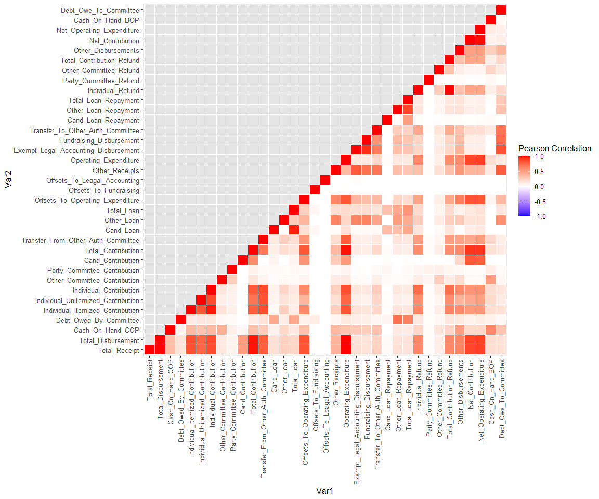
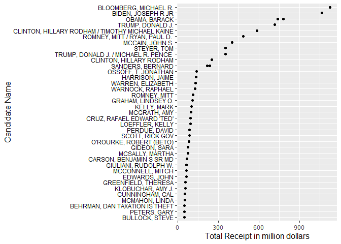
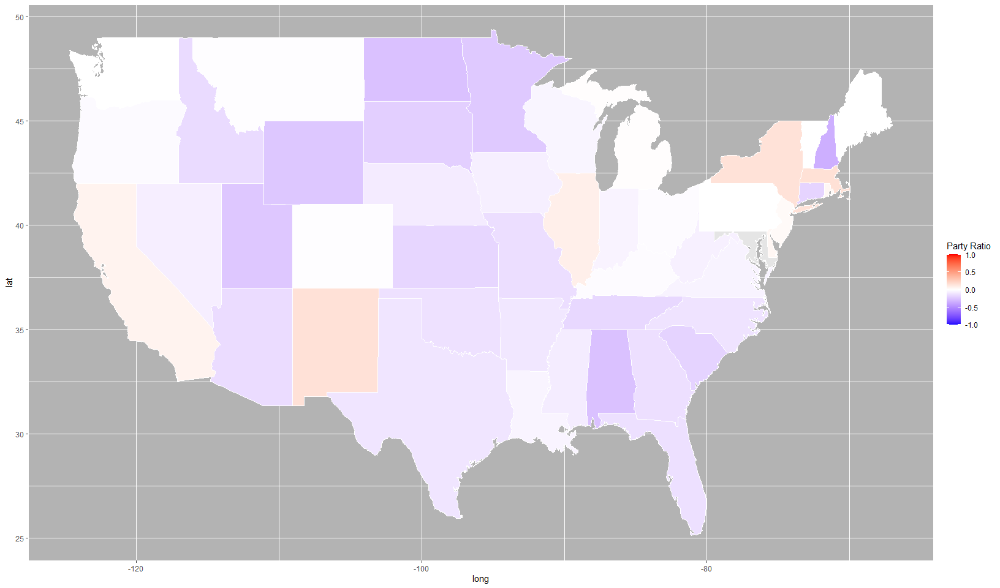
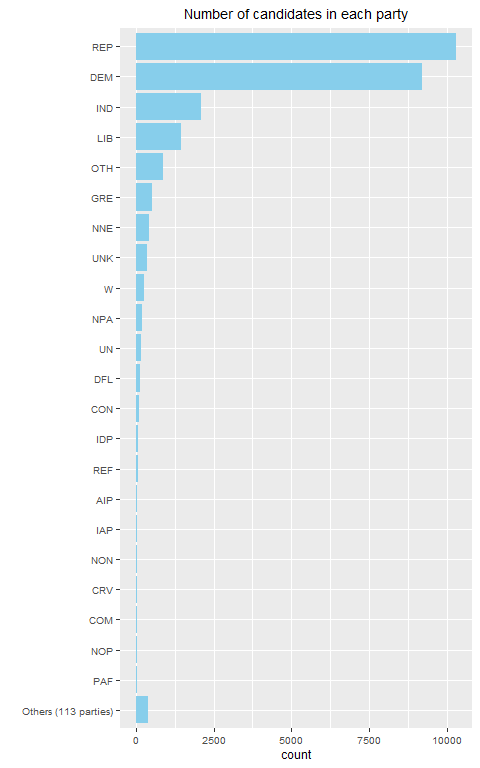
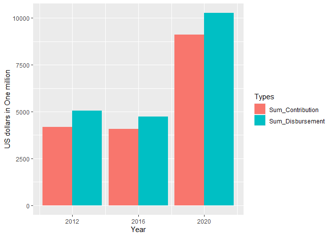

hw2
================

``` r
library(ggplot2)
library(dplyr)
library(tidyverse)
library(gapminder)
library(reshape2)
library(maps)
library(ggmap)
library(lubridate)
```

## Loading and modifying data

``` r
data <- read.csv(file = './data/fec_2008-2022.csv')

data <- data %>% 
  select(-c(X))

# Column with only numerical and int data type
num_data <- data %>% 
  select(where(is.numeric)) %>% 
  select(-c(Cand_Office_Dist, Cand_Zip))

# Convert party affiliation to number -1 to 1 to use later for visualization
data$Cand_State <- tolower(state.name[match(data$Cand_State, state.abb)])
data$Cand_Office_St <- tolower(state.name[match(data$Cand_Office_St, state.abb)])

data <- data %>% mutate(
  Cand_Party_Affiliation_num = case_when(Cand_Party_Affiliation=="DEM" ~ 1,
                                            Cand_Party_Affiliation=="REP" ~ -1,
            Cand_Party_Affiliation!="REP" | Cand_Party_Affiliation!="DEM" ~ 0))


# Check data
# summary(data)
str(data)
```

    ## 'data.frame':    26828 obs. of  51 variables:
    ##  $ Link_Image                          : chr  "https://www.fec.gov/data/candidate/P80003338/?cycle=2008" "https://www.fec.gov/data/candidate/H8FL05116/?cycle=2008" "https://www.fec.gov/data/candidate/H8FL06056/?cycle=2008" "https://www.fec.gov/data/candidate/H8FL06080/?cycle=2008" ...
    ##  $ Cand_Name                           : chr  "OBAMA, BARACK" "CASTAGNERO, CAROL" "STEARNS, CLIFFORD B" "CUNHA, TIMOTHY M" ...
    ##  $ Cand_Id                             : chr  "P80003338" "H8FL05116" "H8FL06056" "H8FL06080" ...
    ##  $ Cand_Office                         : chr  "P" "H" "H" "H" ...
    ##  $ Cand_Office_St                      : chr  NA "florida" "florida" "florida" ...
    ##  $ Cand_Office_Dist                    : int  0 5 6 6 7 7 8 8 8 8 ...
    ##  $ Cand_Party_Affiliation              : chr  "DEM" "DEM" "REP" "DEM" ...
    ##  $ Cand_Incumbent_Challenger_Open_Seat : chr  "OPEN" "CHALLENGER" "INCUMBENT" "CHALLENGER" ...
    ##  $ Total_Receipt                       : num  7.79e+08 0.00 8.06e+05 2.50e+05 3.06e+04 ...
    ##  $ Total_Disbursement                  : num  7.60e+08 2.76e+02 7.90e+05 2.50e+05 2.97e+04 ...
    ##  $ Cash_On_Hand_COP                    : num  18272367 0 2272965 0 0 ...
    ##  $ Debt_Owed_By_Committee              : num  434954 0 0 0 16245 ...
    ##  $ Coverage_End_Date                   : chr  "12/31/2008" "09/30/2008" "12/31/2008" "12/31/2008" ...
    ##  $ Cand_Street_1                       : chr  "PO Box 8102" "4119 GLISSON DR" "2515 SE Ashley Court" "2433 SE 20TH CIRCLE" ...
    ##  $ Cand_Street_2                       : chr  "" "" "" "PO BOX 6546" ...
    ##  $ Cand_City                           : chr  "CHICAGO" "LAKELAND" "Ocala" "OCALA" ...
    ##  $ Cand_State                          : chr  "illinois" "florida" "florida" "florida" ...
    ##  $ Cand_Zip                            : int  60680 33810 34471 34478 32174 32260 32839 34787 32773 32806 ...
    ##  $ Individual_Itemized_Contribution    : num  4.30e+08 0.00 1.50e+05 8.77e+04 8.94e+03 ...
    ##  $ Individual_Unitemized_Contribution  : num  0 0 62366 13973 1115 ...
    ##  $ Individual_Contribution             : num  6.65e+08 0.00 2.12e+05 1.02e+05 1.16e+04 ...
    ##  $ Other_Committee_Contribution        : num  12925 0 372989 21350 0 ...
    ##  $ Party_Committee_Contribution        : num  1150 0 0 0 0 0 0 0 0 0 ...
    ##  $ Cand_Contribution                   : num  0 0 0 5701 1810 ...
    ##  $ Total_Contribution                  : num  6.65e+08 0.00 5.85e+05 1.29e+05 1.34e+04 ...
    ##  $ Transfer_From_Other_Auth_Committee  : num  8.7e+07 0.0 0.0 0.0 0.0 ...
    ##  $ Cand_Loan                           : num  0 0 0 121000 15445 ...
    ##  $ Other_Loan                          : num  0 0 0 0 1700 0 0 0 0 0 ...
    ##  $ Total_Loan                          : num  0 0 0 121000 17145 ...
    ##  $ Offsets_To_Operating_Expenditure    : num  25131132 276 11616 0 9 ...
    ##  $ Offsets_To_Fundraising              : num  0 0 0 0 0 0 0 0 0 0 ...
    ##  $ Offsets_To_Leagal_Accounting        : num  0 0 0 0 0 0 0 0 0 0 ...
    ##  $ Other_Receipts                      : num  1675373 0 209959 0 0 ...
    ##  $ Operating_Expenditure               : num  7.07e+08 1.22e+04 5.22e+05 1.50e+05 2.87e+04 ...
    ##  $ Exempt_Legal_Accounting_Disbursement: num  0 0 0 0 0 0 0 0 0 0 ...
    ##  $ Fundraising_Disbursement            : num  0 0 0 0 0 0 0 0 0 0 ...
    ##  $ Transfer_To_Other_Auth_Committee    : num  0 0 0 0 0 0 0 0 0 0 ...
    ##  $ Cand_Loan_Repayment                 : num  0 276 0 100016 0 ...
    ##  $ Other_Loan_Repayment                : num  0 0 0 0 0 0 0 0 0 0 ...
    ##  $ Total_Loan_Repayment                : num  0 276 0 100016 0 ...
    ##  $ Individual_Refund                   : num  5744310 0 300 25 0 ...
    ##  $ Party_Committee_Refund              : num  300 0 0 0 0 0 0 0 0 0 ...
    ##  $ Other_Committee_Refund              : num  11345 0 0 0 0 ...
    ##  $ Total_Contribution_Refund           : num  5755955 0 300 25 0 ...
    ##  $ Other_Disbursements                 : num  47945663 0 267040 0 1013 ...
    ##  $ Net_Contribution                    : num  4.31e+09 0.00 5.85e+05 1.29e+05 1.34e+04 ...
    ##  $ Net_Operating_Expenditure           : num  3.72e+09 0.00 5.11e+05 1.50e+05 2.86e+04 ...
    ##  $ Cash_On_Hand_BOP                    : num  0 0 2258098 0 0 ...
    ##  $ Debt_Owe_To_Committee               : num  0 0 0 0 0 0 0 0 NA 0 ...
    ##  $ Coverage_Start_Date                 : chr  "01/01/2007" "07/01/2008" "01/01/2007" "04/01/2008" ...
    ##  $ Cand_Party_Affiliation_num          : num  1 1 -1 1 1 1 1 1 1 1 ...

## Correlation

``` r
num_data$Debt_Owe_To_Committee[is.na(num_data$Debt_Owe_To_Committee)] <- median(num_data$Debt_Owe_To_Committee, na.rm=TRUE)

num_data$Debt_Owed_By_Committee[is.na(num_data$Debt_Owed_By_Committee)] <- median(num_data$Debt_Owed_By_Committee, na.rm=TRUE)

num_data$Cash_On_Hand_BOP[is.na(num_data$Cash_On_Hand_BOP)] <- median(num_data$Cash_On_Hand_BOP, na.rm=TRUE)

num_data$Cash_On_Hand_COP[is.na(num_data$Cash_On_Hand_COP)] <- median(num_data$Cash_On_Hand_COP, na.rm=TRUE)


# Get correlation matrix
corr <- cor(num_data)

# Fill upper triangle to NaN values
corr[lower.tri(corr)] <- NA

# Melt to one to one dataframe
corr <- melt(corr)

# corr

# Part for sorting unused
# group_corr <- corr %>% 
#   drop_na() %>% 
#   group_by(Var2) %>% 
#   summarize(med_value= median(value))
# 
# group_corr
# 
# corr <- corr %>% 
#   left_join(group_corr, by="Var2")
# 
# corr <- corr[order(corr$med_val, corr$Var2),]
```

``` r
ggplot(data=corr, aes(x=Var1, y=Var2, fill=value)) +
  geom_tile(color="white") +
  scale_x_discrete(position = "top") +
  theme(text = element_text(size=12),
        axis.text.x = element_text(angle = 90, hjust=0, vjust=0.5)) +
  scale_fill_gradient2(low="blue", mid="white", high="red", na.value = "grey90",
                       limit = c(-1,1), name="Pearson Correlation")
```

<!-- -->

Type of information: 1. correlation between variables.

Findings: 1. Total receipt, total disbursement, total contribution, and
operating expenditure have very high correlation. 2. All variables have
higher than 0 correlation each other.

## Candidate VS Total\_Receipt

``` r
# Sort by Total_Receipt and get top 50 candidates
receipt_data = data[order(-data$Total_Receipt),]
receipt_data = receipt_data[0:50,]

ggplot(receipt_data, aes(x=reorder(Cand_Name,Total_Receipt), y=Total_Receipt/1000000)) +
  geom_point() +
  coord_flip() +
  theme(text = element_text(size=13, color="black"), axis.text.y=element_text(colour="black"),
        axis.title=element_text(size=14,face="bold")) +
  labs(x="Candidate Name", y="Total Receipt in million dollars")
```

<!-- -->

Type of information: 1. Trends of total receipt 2. Who get more receipt

Findings 1. A few famous people dominates total receipt.(exponentially
increases) 2. Large variance for top ten people, small variance for
others.

## Party Affiliation Ratio by states

``` r
# Get party_ratio on each states
party_ratio_states <- data %>%
  group_by(Cand_Office_St) %>%
  summarize(party_ratio = mean(Cand_Party_Affiliation_num)) %>% 
  select(c(Cand_Office_St, party_ratio))
```

    ## `summarise()` ungrouping output (override with `.groups` argument)

``` r
head(party_ratio_states)
```

    ## # A tibble: 6 x 2
    ##   Cand_Office_St party_ratio
    ##   <chr>                <dbl>
    ## 1 alabama           -0.264  
    ## 2 alaska            -0.0952 
    ## 3 arizona           -0.148  
    ## 4 arkansas          -0.103  
    ## 5 california         0.0606 
    ## 6 colorado          -0.00667

``` r
# Get map of united states consisting of longitude and latitude
states_map <- map_data("state")

head(states_map)
```

    ##        long      lat group order  region subregion
    ## 1 -87.46201 30.38968     1     1 alabama      <NA>
    ## 2 -87.48493 30.37249     1     2 alabama      <NA>
    ## 3 -87.52503 30.37249     1     3 alabama      <NA>
    ## 4 -87.53076 30.33239     1     4 alabama      <NA>
    ## 5 -87.57087 30.32665     1     5 alabama      <NA>
    ## 6 -87.58806 30.32665     1     6 alabama      <NA>

``` r
map_data <- left_join(party_ratio_states , states_map, by=c("Cand_Office_St" = "region"))

head(map_data)
```

    ## # A tibble: 6 x 7
    ##   Cand_Office_St party_ratio  long   lat group order subregion
    ##   <chr>                <dbl> <dbl> <dbl> <dbl> <int> <chr>    
    ## 1 alabama             -0.264 -87.5  30.4     1     1 <NA>     
    ## 2 alabama             -0.264 -87.5  30.4     1     2 <NA>     
    ## 3 alabama             -0.264 -87.5  30.4     1     3 <NA>     
    ## 4 alabama             -0.264 -87.5  30.3     1     4 <NA>     
    ## 5 alabama             -0.264 -87.6  30.3     1     5 <NA>     
    ## 6 alabama             -0.264 -87.6  30.3     1     6 <NA>

``` r
ggplot(map_data, aes(long, lat, group = group)) +
  geom_polygon(aes(fill = party_ratio), color = "white") +
    scale_fill_gradient2(limit = c(-1,1),low="blue", mid="white", high="red", 
                         na.value = "grey90", name="Party Ratio") + 
  theme(panel.background = element_rect(fill = 'grey70', colour = 'white'))
```

<!-- -->

Type of information: 1. Ratio of office for party affiliation in each
state

What we can see: 1. Most regions are close to 0, so that means number of
offices for each party in each state is not that biased. 2. A few
democratic 3. More Democratic offices on West and East coast.

## Party Affiliations and their numbers

``` r
data2 <- data %>% 
  group_by(Cand_Party_Affiliation) %>% 
  mutate(count=n())

ggplot(data2, aes(x=reorder(Cand_Party_Affiliation, count), y=count)) +
  geom_bar(stat="identity", fill="skyblue") +
  coord_flip()
```

<!-- -->

Type of information: 1. Number of party affiliations in US. 2. Trends of
support for party affiliations

What we can see:

1.  There are so many party affiliations other than Republic and
    Democratic with almost 0 people.
2.  Majorities are either Republcan, Democratic, or Independent.
3.  There are so many party affiliations other than Republic and
    Democratic.

## Part 2

Hypothesis: Interest toward US politics increased significantly in 2020
election.

``` r
# Extract Year from date
data$End_Year = year(as.Date(data$Coverage_End_Date, format = "%m/%d/%Y"))
```

``` r
year_cont <- data %>% 
  select(End_Year, Total_Contribution, Total_Disbursement)

unique(year_cont$End_Year)
```

    ##  [1] 2008   NA 2007 2009 2010 2090 2011 2012 2013 2014 2016 2015 2017 2018 2019
    ## [16] 2020 2021

``` r
year_cont <- year_cont %>% mutate(
  End_Year= case_when(End_Year >= 2009 & End_Year <= 2012 ~ 2012,
                      End_Year >= 2013 & End_Year <= 2016 ~ 2016,
                      End_Year >= 2017 & End_Year <= 2020 ~ 2020))


year_cont <- year_cont %>% group_by(End_Year) %>% 
  drop_na() %>% 
  filter(End_Year > 2008 & End_Year < 2021) %>% 
  summarize(Sum_Contribution = sum(Total_Contribution)/1000000,
            Sum_Disbursement = sum(Total_Disbursement)/1000000)
```

    ## `summarise()` ungrouping output (override with `.groups` argument)

``` r
year_cont <- as.data.frame(year_cont)

head(year_cont)
```

    ##   End_Year Sum_Contribution Sum_Disbursement
    ## 1     2012         4183.073         5060.868
    ## 2     2016         4061.900         4730.819
    ## 3     2020         9110.395        10265.873

``` r
year_cont <- melt(data=year_cont, id.vars="End_Year", measure.vars=c("Sum_Contribution", "Sum_Disbursement"))
```

``` r
ggplot(data=year_cont, aes(x=End_Year, y=value, fill=variable)) +
  geom_bar(stat="identity", position = "dodge") + 
  scale_x_continuous(breaks= c(2012, 2016, 2020)) +
  labs(x="Year", y="US dollars in One million", fill='Types')
```

<!-- -->

Both 2012 and 2016 doesn’t look that different, but contribution and
disbursement increased almost two times as much as those in 2012 and
2016.This shows that public interest toward politics went much higher
because many people donated their money to candidates.
