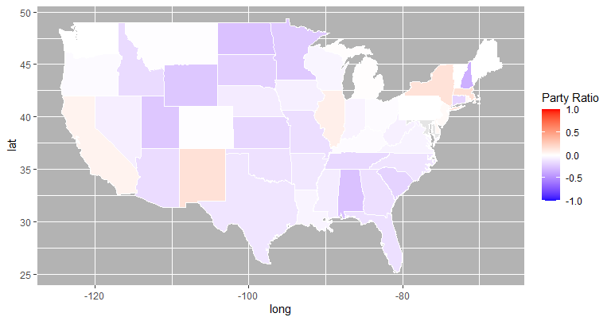

hw2
================

``` r
library(ggplot2)
library(dplyr)
library(tidyverse)
library(gapminder)
library(reshape2)
library(maps)
library(ggmap)
```

## Loading and modifying data

``` r
data <- read.csv(file = './data/fec_2008-2022.csv')

data <- data %>% 
  select(-c(X))

# Column with only numerical and int data type
num_data <- data %>% 
  select(where(is.numeric)) %>% 
  select(-c(Cand_Office_Dist, Cand_Zip))

# Convert party affiliation to number -1 to 1 to use later for visualization
data$Cand_State <- tolower(state.name[match(data$Cand_State, state.abb)])
data$Cand_Office_St <- tolower(state.name[match(data$Cand_Office_St, state.abb)])

data <- data %>% mutate(
  Cand_Party_Affiliation_num = case_when(Cand_Party_Affiliation=="DEM" ~ 1,
                                            Cand_Party_Affiliation=="REP" ~ -1,
            Cand_Party_Affiliation!="REP" | Cand_Party_Affiliation!="DEM" ~ 0))


# Check data
# summary(data)
str(data)
```

    ## 'data.frame':    26828 obs. of  51 variables:
    ##  $ Link_Image                          : chr  "https://www.fec.gov/data/candidate/P80003338/?cycle=2008" "https://www.fec.gov/data/candidate/H8FL05116/?cycle=2008" "https://www.fec.gov/data/candidate/H8FL06056/?cycle=2008" "https://www.fec.gov/data/candidate/H8FL06080/?cycle=2008" ...
    ##  $ Cand_Name                           : chr  "OBAMA, BARACK" "CASTAGNERO, CAROL" "STEARNS, CLIFFORD B" "CUNHA, TIMOTHY M" ...
    ##  $ Cand_Id                             : chr  "P80003338" "H8FL05116" "H8FL06056" "H8FL06080" ...
    ##  $ Cand_Office                         : chr  "P" "H" "H" "H" ...
    ##  $ Cand_Office_St                      : chr  NA "florida" "florida" "florida" ...
    ##  $ Cand_Office_Dist                    : int  0 5 6 6 7 7 8 8 8 8 ...
    ##  $ Cand_Party_Affiliation              : chr  "DEM" "DEM" "REP" "DEM" ...
    ##  $ Cand_Incumbent_Challenger_Open_Seat : chr  "OPEN" "CHALLENGER" "INCUMBENT" "CHALLENGER" ...
    ##  $ Total_Receipt                       : num  7.79e+08 0.00 8.06e+05 2.50e+05 3.06e+04 ...
    ##  $ Total_Disbursement                  : num  7.60e+08 2.76e+02 7.90e+05 2.50e+05 2.97e+04 ...
    ##  $ Cash_On_Hand_COP                    : num  18272367 0 2272965 0 0 ...
    ##  $ Debt_Owed_By_Committee              : num  434954 0 0 0 16245 ...
    ##  $ Coverage_End_Date                   : chr  "12/31/2008" "09/30/2008" "12/31/2008" "12/31/2008" ...
    ##  $ Cand_Street_1                       : chr  "PO Box 8102" "4119 GLISSON DR" "2515 SE Ashley Court" "2433 SE 20TH CIRCLE" ...
    ##  $ Cand_Street_2                       : chr  "" "" "" "PO BOX 6546" ...
    ##  $ Cand_City                           : chr  "CHICAGO" "LAKELAND" "Ocala" "OCALA" ...
    ##  $ Cand_State                          : chr  "illinois" "florida" "florida" "florida" ...
    ##  $ Cand_Zip                            : int  60680 33810 34471 34478 32174 32260 32839 34787 32773 32806 ...
    ##  $ Individual_Itemized_Contribution    : num  4.30e+08 0.00 1.50e+05 8.77e+04 8.94e+03 ...
    ##  $ Individual_Unitemized_Contribution  : num  0 0 62366 13973 1115 ...
    ##  $ Individual_Contribution             : num  6.65e+08 0.00 2.12e+05 1.02e+05 1.16e+04 ...
    ##  $ Other_Committee_Contribution        : num  12925 0 372989 21350 0 ...
    ##  $ Party_Committee_Contribution        : num  1150 0 0 0 0 0 0 0 0 0 ...
    ##  $ Cand_Contribution                   : num  0 0 0 5701 1810 ...
    ##  $ Total_Contribution                  : num  6.65e+08 0.00 5.85e+05 1.29e+05 1.34e+04 ...
    ##  $ Transfer_From_Other_Auth_Committee  : num  8.7e+07 0.0 0.0 0.0 0.0 ...
    ##  $ Cand_Loan                           : num  0 0 0 121000 15445 ...
    ##  $ Other_Loan                          : num  0 0 0 0 1700 0 0 0 0 0 ...
    ##  $ Total_Loan                          : num  0 0 0 121000 17145 ...
    ##  $ Offsets_To_Operating_Expenditure    : num  25131132 276 11616 0 9 ...
    ##  $ Offsets_To_Fundraising              : num  0 0 0 0 0 0 0 0 0 0 ...
    ##  $ Offsets_To_Leagal_Accounting        : num  0 0 0 0 0 0 0 0 0 0 ...
    ##  $ Other_Receipts                      : num  1675373 0 209959 0 0 ...
    ##  $ Operating_Expenditure               : num  7.07e+08 1.22e+04 5.22e+05 1.50e+05 2.87e+04 ...
    ##  $ Exempt_Legal_Accounting_Disbursement: num  0 0 0 0 0 0 0 0 0 0 ...
    ##  $ Fundraising_Disbursement            : num  0 0 0 0 0 0 0 0 0 0 ...
    ##  $ Transfer_To_Other_Auth_Committee    : num  0 0 0 0 0 0 0 0 0 0 ...
    ##  $ Cand_Loan_Repayment                 : num  0 276 0 100016 0 ...
    ##  $ Other_Loan_Repayment                : num  0 0 0 0 0 0 0 0 0 0 ...
    ##  $ Total_Loan_Repayment                : num  0 276 0 100016 0 ...
    ##  $ Individual_Refund                   : num  5744310 0 300 25 0 ...
    ##  $ Party_Committee_Refund              : num  300 0 0 0 0 0 0 0 0 0 ...
    ##  $ Other_Committee_Refund              : num  11345 0 0 0 0 ...
    ##  $ Total_Contribution_Refund           : num  5755955 0 300 25 0 ...
    ##  $ Other_Disbursements                 : num  47945663 0 267040 0 1013 ...
    ##  $ Net_Contribution                    : num  4.31e+09 0.00 5.85e+05 1.29e+05 1.34e+04 ...
    ##  $ Net_Operating_Expenditure           : num  3.72e+09 0.00 5.11e+05 1.50e+05 2.86e+04 ...
    ##  $ Cash_On_Hand_BOP                    : num  0 0 2258098 0 0 ...
    ##  $ Debt_Owe_To_Committee               : num  0 0 0 0 0 0 0 0 NA 0 ...
    ##  $ Coverage_Start_Date                 : chr  "01/01/2007" "07/01/2008" "01/01/2007" "04/01/2008" ...
    ##  $ Cand_Party_Affiliation_num          : num  1 1 -1 1 1 1 1 1 1 1 ...

## Correlation

``` r
num_data$Debt_Owe_To_Committee[is.na(num_data$Debt_Owe_To_Committee)] <- median(num_data$Debt_Owe_To_Committee, na.rm=TRUE)

num_data$Debt_Owed_By_Committee[is.na(num_data$Debt_Owed_By_Committee)] <- median(num_data$Debt_Owed_By_Committee, na.rm=TRUE)

num_data$Cash_On_Hand_BOP[is.na(num_data$Cash_On_Hand_BOP)] <- median(num_data$Cash_On_Hand_BOP, na.rm=TRUE)

num_data$Cash_On_Hand_COP[is.na(num_data$Cash_On_Hand_COP)] <- median(num_data$Cash_On_Hand_COP, na.rm=TRUE)


# Get correlation matrix
corr <- cor(num_data)

# Fill upper triangle to NaN values
corr[upper.tri(corr)] <- NA

# Melt to one to one dataframe
corr <- melt(corr)

corr
```

    ##                                      Var1                                 Var2
    ## 1                           Total_Receipt                        Total_Receipt
    ## 2                      Total_Disbursement                        Total_Receipt
    ## 3                        Cash_On_Hand_COP                        Total_Receipt
    ## 4                  Debt_Owed_By_Committee                        Total_Receipt
    ## 5        Individual_Itemized_Contribution                        Total_Receipt
    ## 6      Individual_Unitemized_Contribution                        Total_Receipt
    ## 7                 Individual_Contribution                        Total_Receipt
    ## 8            Other_Committee_Contribution                        Total_Receipt
    ## 9            Party_Committee_Contribution                        Total_Receipt
    ## 10                      Cand_Contribution                        Total_Receipt
    ## 11                     Total_Contribution                        Total_Receipt
    ## 12     Transfer_From_Other_Auth_Committee                        Total_Receipt
    ## 13                              Cand_Loan                        Total_Receipt
    ## 14                             Other_Loan                        Total_Receipt
    ## 15                             Total_Loan                        Total_Receipt
    ## 16       Offsets_To_Operating_Expenditure                        Total_Receipt
    ## 17                 Offsets_To_Fundraising                        Total_Receipt
    ## 18           Offsets_To_Leagal_Accounting                        Total_Receipt
    ## 19                         Other_Receipts                        Total_Receipt
    ## 20                  Operating_Expenditure                        Total_Receipt
    ## 21   Exempt_Legal_Accounting_Disbursement                        Total_Receipt
    ## 22               Fundraising_Disbursement                        Total_Receipt
    ## 23       Transfer_To_Other_Auth_Committee                        Total_Receipt
    ## 24                    Cand_Loan_Repayment                        Total_Receipt
    ## 25                   Other_Loan_Repayment                        Total_Receipt
    ## 26                   Total_Loan_Repayment                        Total_Receipt
    ## 27                      Individual_Refund                        Total_Receipt
    ## 28                 Party_Committee_Refund                        Total_Receipt
    ## 29                 Other_Committee_Refund                        Total_Receipt
    ## 30              Total_Contribution_Refund                        Total_Receipt
    ## 31                    Other_Disbursements                        Total_Receipt
    ## 32                       Net_Contribution                        Total_Receipt
    ## 33              Net_Operating_Expenditure                        Total_Receipt
    ## 34                       Cash_On_Hand_BOP                        Total_Receipt
    ## 35                  Debt_Owe_To_Committee                        Total_Receipt
    ## 36                          Total_Receipt                   Total_Disbursement
    ## 37                     Total_Disbursement                   Total_Disbursement
    ## 38                       Cash_On_Hand_COP                   Total_Disbursement
    ## 39                 Debt_Owed_By_Committee                   Total_Disbursement
    ## 40       Individual_Itemized_Contribution                   Total_Disbursement
    ## 41     Individual_Unitemized_Contribution                   Total_Disbursement
    ## 42                Individual_Contribution                   Total_Disbursement
    ## 43           Other_Committee_Contribution                   Total_Disbursement
    ## 44           Party_Committee_Contribution                   Total_Disbursement
    ## 45                      Cand_Contribution                   Total_Disbursement
    ## 46                     Total_Contribution                   Total_Disbursement
    ## 47     Transfer_From_Other_Auth_Committee                   Total_Disbursement
    ## 48                              Cand_Loan                   Total_Disbursement
    ## 49                             Other_Loan                   Total_Disbursement
    ## 50                             Total_Loan                   Total_Disbursement
    ## 51       Offsets_To_Operating_Expenditure                   Total_Disbursement
    ## 52                 Offsets_To_Fundraising                   Total_Disbursement
    ## 53           Offsets_To_Leagal_Accounting                   Total_Disbursement
    ## 54                         Other_Receipts                   Total_Disbursement
    ## 55                  Operating_Expenditure                   Total_Disbursement
    ## 56   Exempt_Legal_Accounting_Disbursement                   Total_Disbursement
    ## 57               Fundraising_Disbursement                   Total_Disbursement
    ## 58       Transfer_To_Other_Auth_Committee                   Total_Disbursement
    ## 59                    Cand_Loan_Repayment                   Total_Disbursement
    ## 60                   Other_Loan_Repayment                   Total_Disbursement
    ## 61                   Total_Loan_Repayment                   Total_Disbursement
    ## 62                      Individual_Refund                   Total_Disbursement
    ## 63                 Party_Committee_Refund                   Total_Disbursement
    ## 64                 Other_Committee_Refund                   Total_Disbursement
    ## 65              Total_Contribution_Refund                   Total_Disbursement
    ## 66                    Other_Disbursements                   Total_Disbursement
    ## 67                       Net_Contribution                   Total_Disbursement
    ## 68              Net_Operating_Expenditure                   Total_Disbursement
    ## 69                       Cash_On_Hand_BOP                   Total_Disbursement
    ## 70                  Debt_Owe_To_Committee                   Total_Disbursement
    ## 71                          Total_Receipt                     Cash_On_Hand_COP
    ## 72                     Total_Disbursement                     Cash_On_Hand_COP
    ## 73                       Cash_On_Hand_COP                     Cash_On_Hand_COP
    ## 74                 Debt_Owed_By_Committee                     Cash_On_Hand_COP
    ## 75       Individual_Itemized_Contribution                     Cash_On_Hand_COP
    ## 76     Individual_Unitemized_Contribution                     Cash_On_Hand_COP
    ## 77                Individual_Contribution                     Cash_On_Hand_COP
    ## 78           Other_Committee_Contribution                     Cash_On_Hand_COP
    ## 79           Party_Committee_Contribution                     Cash_On_Hand_COP
    ## 80                      Cand_Contribution                     Cash_On_Hand_COP
    ## 81                     Total_Contribution                     Cash_On_Hand_COP
    ## 82     Transfer_From_Other_Auth_Committee                     Cash_On_Hand_COP
    ## 83                              Cand_Loan                     Cash_On_Hand_COP
    ## 84                             Other_Loan                     Cash_On_Hand_COP
    ## 85                             Total_Loan                     Cash_On_Hand_COP
    ## 86       Offsets_To_Operating_Expenditure                     Cash_On_Hand_COP
    ## 87                 Offsets_To_Fundraising                     Cash_On_Hand_COP
    ## 88           Offsets_To_Leagal_Accounting                     Cash_On_Hand_COP
    ## 89                         Other_Receipts                     Cash_On_Hand_COP
    ## 90                  Operating_Expenditure                     Cash_On_Hand_COP
    ## 91   Exempt_Legal_Accounting_Disbursement                     Cash_On_Hand_COP
    ## 92               Fundraising_Disbursement                     Cash_On_Hand_COP
    ## 93       Transfer_To_Other_Auth_Committee                     Cash_On_Hand_COP
    ## 94                    Cand_Loan_Repayment                     Cash_On_Hand_COP
    ## 95                   Other_Loan_Repayment                     Cash_On_Hand_COP
    ## 96                   Total_Loan_Repayment                     Cash_On_Hand_COP
    ## 97                      Individual_Refund                     Cash_On_Hand_COP
    ## 98                 Party_Committee_Refund                     Cash_On_Hand_COP
    ## 99                 Other_Committee_Refund                     Cash_On_Hand_COP
    ## 100             Total_Contribution_Refund                     Cash_On_Hand_COP
    ## 101                   Other_Disbursements                     Cash_On_Hand_COP
    ## 102                      Net_Contribution                     Cash_On_Hand_COP
    ## 103             Net_Operating_Expenditure                     Cash_On_Hand_COP
    ## 104                      Cash_On_Hand_BOP                     Cash_On_Hand_COP
    ## 105                 Debt_Owe_To_Committee                     Cash_On_Hand_COP
    ## 106                         Total_Receipt               Debt_Owed_By_Committee
    ## 107                    Total_Disbursement               Debt_Owed_By_Committee
    ## 108                      Cash_On_Hand_COP               Debt_Owed_By_Committee
    ## 109                Debt_Owed_By_Committee               Debt_Owed_By_Committee
    ## 110      Individual_Itemized_Contribution               Debt_Owed_By_Committee
    ## 111    Individual_Unitemized_Contribution               Debt_Owed_By_Committee
    ## 112               Individual_Contribution               Debt_Owed_By_Committee
    ## 113          Other_Committee_Contribution               Debt_Owed_By_Committee
    ## 114          Party_Committee_Contribution               Debt_Owed_By_Committee
    ## 115                     Cand_Contribution               Debt_Owed_By_Committee
    ## 116                    Total_Contribution               Debt_Owed_By_Committee
    ## 117    Transfer_From_Other_Auth_Committee               Debt_Owed_By_Committee
    ## 118                             Cand_Loan               Debt_Owed_By_Committee
    ## 119                            Other_Loan               Debt_Owed_By_Committee
    ## 120                            Total_Loan               Debt_Owed_By_Committee
    ## 121      Offsets_To_Operating_Expenditure               Debt_Owed_By_Committee
    ## 122                Offsets_To_Fundraising               Debt_Owed_By_Committee
    ## 123          Offsets_To_Leagal_Accounting               Debt_Owed_By_Committee
    ## 124                        Other_Receipts               Debt_Owed_By_Committee
    ## 125                 Operating_Expenditure               Debt_Owed_By_Committee
    ## 126  Exempt_Legal_Accounting_Disbursement               Debt_Owed_By_Committee
    ## 127              Fundraising_Disbursement               Debt_Owed_By_Committee
    ## 128      Transfer_To_Other_Auth_Committee               Debt_Owed_By_Committee
    ## 129                   Cand_Loan_Repayment               Debt_Owed_By_Committee
    ## 130                  Other_Loan_Repayment               Debt_Owed_By_Committee
    ## 131                  Total_Loan_Repayment               Debt_Owed_By_Committee
    ## 132                     Individual_Refund               Debt_Owed_By_Committee
    ## 133                Party_Committee_Refund               Debt_Owed_By_Committee
    ## 134                Other_Committee_Refund               Debt_Owed_By_Committee
    ## 135             Total_Contribution_Refund               Debt_Owed_By_Committee
    ## 136                   Other_Disbursements               Debt_Owed_By_Committee
    ## 137                      Net_Contribution               Debt_Owed_By_Committee
    ## 138             Net_Operating_Expenditure               Debt_Owed_By_Committee
    ## 139                      Cash_On_Hand_BOP               Debt_Owed_By_Committee
    ## 140                 Debt_Owe_To_Committee               Debt_Owed_By_Committee
    ## 141                         Total_Receipt     Individual_Itemized_Contribution
    ## 142                    Total_Disbursement     Individual_Itemized_Contribution
    ## 143                      Cash_On_Hand_COP     Individual_Itemized_Contribution
    ## 144                Debt_Owed_By_Committee     Individual_Itemized_Contribution
    ## 145      Individual_Itemized_Contribution     Individual_Itemized_Contribution
    ## 146    Individual_Unitemized_Contribution     Individual_Itemized_Contribution
    ## 147               Individual_Contribution     Individual_Itemized_Contribution
    ## 148          Other_Committee_Contribution     Individual_Itemized_Contribution
    ## 149          Party_Committee_Contribution     Individual_Itemized_Contribution
    ## 150                     Cand_Contribution     Individual_Itemized_Contribution
    ## 151                    Total_Contribution     Individual_Itemized_Contribution
    ## 152    Transfer_From_Other_Auth_Committee     Individual_Itemized_Contribution
    ## 153                             Cand_Loan     Individual_Itemized_Contribution
    ## 154                            Other_Loan     Individual_Itemized_Contribution
    ## 155                            Total_Loan     Individual_Itemized_Contribution
    ## 156      Offsets_To_Operating_Expenditure     Individual_Itemized_Contribution
    ## 157                Offsets_To_Fundraising     Individual_Itemized_Contribution
    ## 158          Offsets_To_Leagal_Accounting     Individual_Itemized_Contribution
    ## 159                        Other_Receipts     Individual_Itemized_Contribution
    ## 160                 Operating_Expenditure     Individual_Itemized_Contribution
    ## 161  Exempt_Legal_Accounting_Disbursement     Individual_Itemized_Contribution
    ## 162              Fundraising_Disbursement     Individual_Itemized_Contribution
    ## 163      Transfer_To_Other_Auth_Committee     Individual_Itemized_Contribution
    ## 164                   Cand_Loan_Repayment     Individual_Itemized_Contribution
    ## 165                  Other_Loan_Repayment     Individual_Itemized_Contribution
    ## 166                  Total_Loan_Repayment     Individual_Itemized_Contribution
    ## 167                     Individual_Refund     Individual_Itemized_Contribution
    ## 168                Party_Committee_Refund     Individual_Itemized_Contribution
    ## 169                Other_Committee_Refund     Individual_Itemized_Contribution
    ## 170             Total_Contribution_Refund     Individual_Itemized_Contribution
    ## 171                   Other_Disbursements     Individual_Itemized_Contribution
    ## 172                      Net_Contribution     Individual_Itemized_Contribution
    ## 173             Net_Operating_Expenditure     Individual_Itemized_Contribution
    ## 174                      Cash_On_Hand_BOP     Individual_Itemized_Contribution
    ## 175                 Debt_Owe_To_Committee     Individual_Itemized_Contribution
    ## 176                         Total_Receipt   Individual_Unitemized_Contribution
    ## 177                    Total_Disbursement   Individual_Unitemized_Contribution
    ## 178                      Cash_On_Hand_COP   Individual_Unitemized_Contribution
    ## 179                Debt_Owed_By_Committee   Individual_Unitemized_Contribution
    ## 180      Individual_Itemized_Contribution   Individual_Unitemized_Contribution
    ## 181    Individual_Unitemized_Contribution   Individual_Unitemized_Contribution
    ## 182               Individual_Contribution   Individual_Unitemized_Contribution
    ## 183          Other_Committee_Contribution   Individual_Unitemized_Contribution
    ## 184          Party_Committee_Contribution   Individual_Unitemized_Contribution
    ## 185                     Cand_Contribution   Individual_Unitemized_Contribution
    ## 186                    Total_Contribution   Individual_Unitemized_Contribution
    ## 187    Transfer_From_Other_Auth_Committee   Individual_Unitemized_Contribution
    ## 188                             Cand_Loan   Individual_Unitemized_Contribution
    ## 189                            Other_Loan   Individual_Unitemized_Contribution
    ## 190                            Total_Loan   Individual_Unitemized_Contribution
    ## 191      Offsets_To_Operating_Expenditure   Individual_Unitemized_Contribution
    ## 192                Offsets_To_Fundraising   Individual_Unitemized_Contribution
    ## 193          Offsets_To_Leagal_Accounting   Individual_Unitemized_Contribution
    ## 194                        Other_Receipts   Individual_Unitemized_Contribution
    ## 195                 Operating_Expenditure   Individual_Unitemized_Contribution
    ## 196  Exempt_Legal_Accounting_Disbursement   Individual_Unitemized_Contribution
    ## 197              Fundraising_Disbursement   Individual_Unitemized_Contribution
    ## 198      Transfer_To_Other_Auth_Committee   Individual_Unitemized_Contribution
    ## 199                   Cand_Loan_Repayment   Individual_Unitemized_Contribution
    ## 200                  Other_Loan_Repayment   Individual_Unitemized_Contribution
    ## 201                  Total_Loan_Repayment   Individual_Unitemized_Contribution
    ## 202                     Individual_Refund   Individual_Unitemized_Contribution
    ## 203                Party_Committee_Refund   Individual_Unitemized_Contribution
    ## 204                Other_Committee_Refund   Individual_Unitemized_Contribution
    ## 205             Total_Contribution_Refund   Individual_Unitemized_Contribution
    ## 206                   Other_Disbursements   Individual_Unitemized_Contribution
    ## 207                      Net_Contribution   Individual_Unitemized_Contribution
    ## 208             Net_Operating_Expenditure   Individual_Unitemized_Contribution
    ## 209                      Cash_On_Hand_BOP   Individual_Unitemized_Contribution
    ## 210                 Debt_Owe_To_Committee   Individual_Unitemized_Contribution
    ## 211                         Total_Receipt              Individual_Contribution
    ## 212                    Total_Disbursement              Individual_Contribution
    ## 213                      Cash_On_Hand_COP              Individual_Contribution
    ## 214                Debt_Owed_By_Committee              Individual_Contribution
    ## 215      Individual_Itemized_Contribution              Individual_Contribution
    ## 216    Individual_Unitemized_Contribution              Individual_Contribution
    ## 217               Individual_Contribution              Individual_Contribution
    ## 218          Other_Committee_Contribution              Individual_Contribution
    ## 219          Party_Committee_Contribution              Individual_Contribution
    ## 220                     Cand_Contribution              Individual_Contribution
    ## 221                    Total_Contribution              Individual_Contribution
    ## 222    Transfer_From_Other_Auth_Committee              Individual_Contribution
    ## 223                             Cand_Loan              Individual_Contribution
    ## 224                            Other_Loan              Individual_Contribution
    ## 225                            Total_Loan              Individual_Contribution
    ## 226      Offsets_To_Operating_Expenditure              Individual_Contribution
    ## 227                Offsets_To_Fundraising              Individual_Contribution
    ## 228          Offsets_To_Leagal_Accounting              Individual_Contribution
    ## 229                        Other_Receipts              Individual_Contribution
    ## 230                 Operating_Expenditure              Individual_Contribution
    ## 231  Exempt_Legal_Accounting_Disbursement              Individual_Contribution
    ## 232              Fundraising_Disbursement              Individual_Contribution
    ## 233      Transfer_To_Other_Auth_Committee              Individual_Contribution
    ## 234                   Cand_Loan_Repayment              Individual_Contribution
    ## 235                  Other_Loan_Repayment              Individual_Contribution
    ## 236                  Total_Loan_Repayment              Individual_Contribution
    ## 237                     Individual_Refund              Individual_Contribution
    ## 238                Party_Committee_Refund              Individual_Contribution
    ## 239                Other_Committee_Refund              Individual_Contribution
    ## 240             Total_Contribution_Refund              Individual_Contribution
    ## 241                   Other_Disbursements              Individual_Contribution
    ## 242                      Net_Contribution              Individual_Contribution
    ## 243             Net_Operating_Expenditure              Individual_Contribution
    ## 244                      Cash_On_Hand_BOP              Individual_Contribution
    ## 245                 Debt_Owe_To_Committee              Individual_Contribution
    ## 246                         Total_Receipt         Other_Committee_Contribution
    ## 247                    Total_Disbursement         Other_Committee_Contribution
    ## 248                      Cash_On_Hand_COP         Other_Committee_Contribution
    ## 249                Debt_Owed_By_Committee         Other_Committee_Contribution
    ## 250      Individual_Itemized_Contribution         Other_Committee_Contribution
    ## 251    Individual_Unitemized_Contribution         Other_Committee_Contribution
    ## 252               Individual_Contribution         Other_Committee_Contribution
    ## 253          Other_Committee_Contribution         Other_Committee_Contribution
    ## 254          Party_Committee_Contribution         Other_Committee_Contribution
    ## 255                     Cand_Contribution         Other_Committee_Contribution
    ## 256                    Total_Contribution         Other_Committee_Contribution
    ## 257    Transfer_From_Other_Auth_Committee         Other_Committee_Contribution
    ## 258                             Cand_Loan         Other_Committee_Contribution
    ## 259                            Other_Loan         Other_Committee_Contribution
    ## 260                            Total_Loan         Other_Committee_Contribution
    ## 261      Offsets_To_Operating_Expenditure         Other_Committee_Contribution
    ## 262                Offsets_To_Fundraising         Other_Committee_Contribution
    ## 263          Offsets_To_Leagal_Accounting         Other_Committee_Contribution
    ## 264                        Other_Receipts         Other_Committee_Contribution
    ## 265                 Operating_Expenditure         Other_Committee_Contribution
    ## 266  Exempt_Legal_Accounting_Disbursement         Other_Committee_Contribution
    ## 267              Fundraising_Disbursement         Other_Committee_Contribution
    ## 268      Transfer_To_Other_Auth_Committee         Other_Committee_Contribution
    ## 269                   Cand_Loan_Repayment         Other_Committee_Contribution
    ## 270                  Other_Loan_Repayment         Other_Committee_Contribution
    ## 271                  Total_Loan_Repayment         Other_Committee_Contribution
    ## 272                     Individual_Refund         Other_Committee_Contribution
    ## 273                Party_Committee_Refund         Other_Committee_Contribution
    ## 274                Other_Committee_Refund         Other_Committee_Contribution
    ## 275             Total_Contribution_Refund         Other_Committee_Contribution
    ## 276                   Other_Disbursements         Other_Committee_Contribution
    ## 277                      Net_Contribution         Other_Committee_Contribution
    ## 278             Net_Operating_Expenditure         Other_Committee_Contribution
    ## 279                      Cash_On_Hand_BOP         Other_Committee_Contribution
    ## 280                 Debt_Owe_To_Committee         Other_Committee_Contribution
    ## 281                         Total_Receipt         Party_Committee_Contribution
    ## 282                    Total_Disbursement         Party_Committee_Contribution
    ## 283                      Cash_On_Hand_COP         Party_Committee_Contribution
    ## 284                Debt_Owed_By_Committee         Party_Committee_Contribution
    ## 285      Individual_Itemized_Contribution         Party_Committee_Contribution
    ## 286    Individual_Unitemized_Contribution         Party_Committee_Contribution
    ## 287               Individual_Contribution         Party_Committee_Contribution
    ## 288          Other_Committee_Contribution         Party_Committee_Contribution
    ## 289          Party_Committee_Contribution         Party_Committee_Contribution
    ## 290                     Cand_Contribution         Party_Committee_Contribution
    ## 291                    Total_Contribution         Party_Committee_Contribution
    ## 292    Transfer_From_Other_Auth_Committee         Party_Committee_Contribution
    ## 293                             Cand_Loan         Party_Committee_Contribution
    ## 294                            Other_Loan         Party_Committee_Contribution
    ## 295                            Total_Loan         Party_Committee_Contribution
    ## 296      Offsets_To_Operating_Expenditure         Party_Committee_Contribution
    ## 297                Offsets_To_Fundraising         Party_Committee_Contribution
    ## 298          Offsets_To_Leagal_Accounting         Party_Committee_Contribution
    ## 299                        Other_Receipts         Party_Committee_Contribution
    ## 300                 Operating_Expenditure         Party_Committee_Contribution
    ## 301  Exempt_Legal_Accounting_Disbursement         Party_Committee_Contribution
    ## 302              Fundraising_Disbursement         Party_Committee_Contribution
    ## 303      Transfer_To_Other_Auth_Committee         Party_Committee_Contribution
    ## 304                   Cand_Loan_Repayment         Party_Committee_Contribution
    ## 305                  Other_Loan_Repayment         Party_Committee_Contribution
    ## 306                  Total_Loan_Repayment         Party_Committee_Contribution
    ## 307                     Individual_Refund         Party_Committee_Contribution
    ## 308                Party_Committee_Refund         Party_Committee_Contribution
    ## 309                Other_Committee_Refund         Party_Committee_Contribution
    ## 310             Total_Contribution_Refund         Party_Committee_Contribution
    ## 311                   Other_Disbursements         Party_Committee_Contribution
    ## 312                      Net_Contribution         Party_Committee_Contribution
    ## 313             Net_Operating_Expenditure         Party_Committee_Contribution
    ## 314                      Cash_On_Hand_BOP         Party_Committee_Contribution
    ## 315                 Debt_Owe_To_Committee         Party_Committee_Contribution
    ## 316                         Total_Receipt                    Cand_Contribution
    ## 317                    Total_Disbursement                    Cand_Contribution
    ## 318                      Cash_On_Hand_COP                    Cand_Contribution
    ## 319                Debt_Owed_By_Committee                    Cand_Contribution
    ## 320      Individual_Itemized_Contribution                    Cand_Contribution
    ## 321    Individual_Unitemized_Contribution                    Cand_Contribution
    ## 322               Individual_Contribution                    Cand_Contribution
    ## 323          Other_Committee_Contribution                    Cand_Contribution
    ## 324          Party_Committee_Contribution                    Cand_Contribution
    ## 325                     Cand_Contribution                    Cand_Contribution
    ## 326                    Total_Contribution                    Cand_Contribution
    ## 327    Transfer_From_Other_Auth_Committee                    Cand_Contribution
    ## 328                             Cand_Loan                    Cand_Contribution
    ## 329                            Other_Loan                    Cand_Contribution
    ## 330                            Total_Loan                    Cand_Contribution
    ## 331      Offsets_To_Operating_Expenditure                    Cand_Contribution
    ## 332                Offsets_To_Fundraising                    Cand_Contribution
    ## 333          Offsets_To_Leagal_Accounting                    Cand_Contribution
    ## 334                        Other_Receipts                    Cand_Contribution
    ## 335                 Operating_Expenditure                    Cand_Contribution
    ## 336  Exempt_Legal_Accounting_Disbursement                    Cand_Contribution
    ## 337              Fundraising_Disbursement                    Cand_Contribution
    ## 338      Transfer_To_Other_Auth_Committee                    Cand_Contribution
    ## 339                   Cand_Loan_Repayment                    Cand_Contribution
    ## 340                  Other_Loan_Repayment                    Cand_Contribution
    ## 341                  Total_Loan_Repayment                    Cand_Contribution
    ## 342                     Individual_Refund                    Cand_Contribution
    ## 343                Party_Committee_Refund                    Cand_Contribution
    ## 344                Other_Committee_Refund                    Cand_Contribution
    ## 345             Total_Contribution_Refund                    Cand_Contribution
    ## 346                   Other_Disbursements                    Cand_Contribution
    ## 347                      Net_Contribution                    Cand_Contribution
    ## 348             Net_Operating_Expenditure                    Cand_Contribution
    ## 349                      Cash_On_Hand_BOP                    Cand_Contribution
    ## 350                 Debt_Owe_To_Committee                    Cand_Contribution
    ## 351                         Total_Receipt                   Total_Contribution
    ## 352                    Total_Disbursement                   Total_Contribution
    ## 353                      Cash_On_Hand_COP                   Total_Contribution
    ## 354                Debt_Owed_By_Committee                   Total_Contribution
    ## 355      Individual_Itemized_Contribution                   Total_Contribution
    ## 356    Individual_Unitemized_Contribution                   Total_Contribution
    ## 357               Individual_Contribution                   Total_Contribution
    ## 358          Other_Committee_Contribution                   Total_Contribution
    ## 359          Party_Committee_Contribution                   Total_Contribution
    ## 360                     Cand_Contribution                   Total_Contribution
    ## 361                    Total_Contribution                   Total_Contribution
    ## 362    Transfer_From_Other_Auth_Committee                   Total_Contribution
    ## 363                             Cand_Loan                   Total_Contribution
    ## 364                            Other_Loan                   Total_Contribution
    ## 365                            Total_Loan                   Total_Contribution
    ## 366      Offsets_To_Operating_Expenditure                   Total_Contribution
    ## 367                Offsets_To_Fundraising                   Total_Contribution
    ## 368          Offsets_To_Leagal_Accounting                   Total_Contribution
    ## 369                        Other_Receipts                   Total_Contribution
    ## 370                 Operating_Expenditure                   Total_Contribution
    ## 371  Exempt_Legal_Accounting_Disbursement                   Total_Contribution
    ## 372              Fundraising_Disbursement                   Total_Contribution
    ## 373      Transfer_To_Other_Auth_Committee                   Total_Contribution
    ## 374                   Cand_Loan_Repayment                   Total_Contribution
    ## 375                  Other_Loan_Repayment                   Total_Contribution
    ## 376                  Total_Loan_Repayment                   Total_Contribution
    ## 377                     Individual_Refund                   Total_Contribution
    ## 378                Party_Committee_Refund                   Total_Contribution
    ## 379                Other_Committee_Refund                   Total_Contribution
    ## 380             Total_Contribution_Refund                   Total_Contribution
    ## 381                   Other_Disbursements                   Total_Contribution
    ## 382                      Net_Contribution                   Total_Contribution
    ## 383             Net_Operating_Expenditure                   Total_Contribution
    ## 384                      Cash_On_Hand_BOP                   Total_Contribution
    ## 385                 Debt_Owe_To_Committee                   Total_Contribution
    ## 386                         Total_Receipt   Transfer_From_Other_Auth_Committee
    ## 387                    Total_Disbursement   Transfer_From_Other_Auth_Committee
    ## 388                      Cash_On_Hand_COP   Transfer_From_Other_Auth_Committee
    ## 389                Debt_Owed_By_Committee   Transfer_From_Other_Auth_Committee
    ## 390      Individual_Itemized_Contribution   Transfer_From_Other_Auth_Committee
    ## 391    Individual_Unitemized_Contribution   Transfer_From_Other_Auth_Committee
    ## 392               Individual_Contribution   Transfer_From_Other_Auth_Committee
    ## 393          Other_Committee_Contribution   Transfer_From_Other_Auth_Committee
    ## 394          Party_Committee_Contribution   Transfer_From_Other_Auth_Committee
    ## 395                     Cand_Contribution   Transfer_From_Other_Auth_Committee
    ## 396                    Total_Contribution   Transfer_From_Other_Auth_Committee
    ## 397    Transfer_From_Other_Auth_Committee   Transfer_From_Other_Auth_Committee
    ## 398                             Cand_Loan   Transfer_From_Other_Auth_Committee
    ## 399                            Other_Loan   Transfer_From_Other_Auth_Committee
    ## 400                            Total_Loan   Transfer_From_Other_Auth_Committee
    ## 401      Offsets_To_Operating_Expenditure   Transfer_From_Other_Auth_Committee
    ## 402                Offsets_To_Fundraising   Transfer_From_Other_Auth_Committee
    ## 403          Offsets_To_Leagal_Accounting   Transfer_From_Other_Auth_Committee
    ## 404                        Other_Receipts   Transfer_From_Other_Auth_Committee
    ## 405                 Operating_Expenditure   Transfer_From_Other_Auth_Committee
    ## 406  Exempt_Legal_Accounting_Disbursement   Transfer_From_Other_Auth_Committee
    ## 407              Fundraising_Disbursement   Transfer_From_Other_Auth_Committee
    ## 408      Transfer_To_Other_Auth_Committee   Transfer_From_Other_Auth_Committee
    ## 409                   Cand_Loan_Repayment   Transfer_From_Other_Auth_Committee
    ## 410                  Other_Loan_Repayment   Transfer_From_Other_Auth_Committee
    ## 411                  Total_Loan_Repayment   Transfer_From_Other_Auth_Committee
    ## 412                     Individual_Refund   Transfer_From_Other_Auth_Committee
    ## 413                Party_Committee_Refund   Transfer_From_Other_Auth_Committee
    ## 414                Other_Committee_Refund   Transfer_From_Other_Auth_Committee
    ## 415             Total_Contribution_Refund   Transfer_From_Other_Auth_Committee
    ## 416                   Other_Disbursements   Transfer_From_Other_Auth_Committee
    ## 417                      Net_Contribution   Transfer_From_Other_Auth_Committee
    ## 418             Net_Operating_Expenditure   Transfer_From_Other_Auth_Committee
    ## 419                      Cash_On_Hand_BOP   Transfer_From_Other_Auth_Committee
    ## 420                 Debt_Owe_To_Committee   Transfer_From_Other_Auth_Committee
    ## 421                         Total_Receipt                            Cand_Loan
    ## 422                    Total_Disbursement                            Cand_Loan
    ## 423                      Cash_On_Hand_COP                            Cand_Loan
    ## 424                Debt_Owed_By_Committee                            Cand_Loan
    ## 425      Individual_Itemized_Contribution                            Cand_Loan
    ## 426    Individual_Unitemized_Contribution                            Cand_Loan
    ## 427               Individual_Contribution                            Cand_Loan
    ## 428          Other_Committee_Contribution                            Cand_Loan
    ## 429          Party_Committee_Contribution                            Cand_Loan
    ## 430                     Cand_Contribution                            Cand_Loan
    ## 431                    Total_Contribution                            Cand_Loan
    ## 432    Transfer_From_Other_Auth_Committee                            Cand_Loan
    ## 433                             Cand_Loan                            Cand_Loan
    ## 434                            Other_Loan                            Cand_Loan
    ## 435                            Total_Loan                            Cand_Loan
    ## 436      Offsets_To_Operating_Expenditure                            Cand_Loan
    ## 437                Offsets_To_Fundraising                            Cand_Loan
    ## 438          Offsets_To_Leagal_Accounting                            Cand_Loan
    ## 439                        Other_Receipts                            Cand_Loan
    ## 440                 Operating_Expenditure                            Cand_Loan
    ## 441  Exempt_Legal_Accounting_Disbursement                            Cand_Loan
    ## 442              Fundraising_Disbursement                            Cand_Loan
    ## 443      Transfer_To_Other_Auth_Committee                            Cand_Loan
    ## 444                   Cand_Loan_Repayment                            Cand_Loan
    ## 445                  Other_Loan_Repayment                            Cand_Loan
    ## 446                  Total_Loan_Repayment                            Cand_Loan
    ## 447                     Individual_Refund                            Cand_Loan
    ## 448                Party_Committee_Refund                            Cand_Loan
    ## 449                Other_Committee_Refund                            Cand_Loan
    ## 450             Total_Contribution_Refund                            Cand_Loan
    ## 451                   Other_Disbursements                            Cand_Loan
    ## 452                      Net_Contribution                            Cand_Loan
    ## 453             Net_Operating_Expenditure                            Cand_Loan
    ## 454                      Cash_On_Hand_BOP                            Cand_Loan
    ## 455                 Debt_Owe_To_Committee                            Cand_Loan
    ## 456                         Total_Receipt                           Other_Loan
    ## 457                    Total_Disbursement                           Other_Loan
    ## 458                      Cash_On_Hand_COP                           Other_Loan
    ## 459                Debt_Owed_By_Committee                           Other_Loan
    ## 460      Individual_Itemized_Contribution                           Other_Loan
    ## 461    Individual_Unitemized_Contribution                           Other_Loan
    ## 462               Individual_Contribution                           Other_Loan
    ## 463          Other_Committee_Contribution                           Other_Loan
    ## 464          Party_Committee_Contribution                           Other_Loan
    ## 465                     Cand_Contribution                           Other_Loan
    ## 466                    Total_Contribution                           Other_Loan
    ## 467    Transfer_From_Other_Auth_Committee                           Other_Loan
    ## 468                             Cand_Loan                           Other_Loan
    ## 469                            Other_Loan                           Other_Loan
    ## 470                            Total_Loan                           Other_Loan
    ## 471      Offsets_To_Operating_Expenditure                           Other_Loan
    ## 472                Offsets_To_Fundraising                           Other_Loan
    ## 473          Offsets_To_Leagal_Accounting                           Other_Loan
    ## 474                        Other_Receipts                           Other_Loan
    ## 475                 Operating_Expenditure                           Other_Loan
    ## 476  Exempt_Legal_Accounting_Disbursement                           Other_Loan
    ## 477              Fundraising_Disbursement                           Other_Loan
    ## 478      Transfer_To_Other_Auth_Committee                           Other_Loan
    ## 479                   Cand_Loan_Repayment                           Other_Loan
    ## 480                  Other_Loan_Repayment                           Other_Loan
    ## 481                  Total_Loan_Repayment                           Other_Loan
    ## 482                     Individual_Refund                           Other_Loan
    ## 483                Party_Committee_Refund                           Other_Loan
    ## 484                Other_Committee_Refund                           Other_Loan
    ## 485             Total_Contribution_Refund                           Other_Loan
    ## 486                   Other_Disbursements                           Other_Loan
    ## 487                      Net_Contribution                           Other_Loan
    ## 488             Net_Operating_Expenditure                           Other_Loan
    ## 489                      Cash_On_Hand_BOP                           Other_Loan
    ## 490                 Debt_Owe_To_Committee                           Other_Loan
    ## 491                         Total_Receipt                           Total_Loan
    ## 492                    Total_Disbursement                           Total_Loan
    ## 493                      Cash_On_Hand_COP                           Total_Loan
    ## 494                Debt_Owed_By_Committee                           Total_Loan
    ## 495      Individual_Itemized_Contribution                           Total_Loan
    ## 496    Individual_Unitemized_Contribution                           Total_Loan
    ## 497               Individual_Contribution                           Total_Loan
    ## 498          Other_Committee_Contribution                           Total_Loan
    ## 499          Party_Committee_Contribution                           Total_Loan
    ## 500                     Cand_Contribution                           Total_Loan
    ## 501                    Total_Contribution                           Total_Loan
    ## 502    Transfer_From_Other_Auth_Committee                           Total_Loan
    ## 503                             Cand_Loan                           Total_Loan
    ## 504                            Other_Loan                           Total_Loan
    ## 505                            Total_Loan                           Total_Loan
    ## 506      Offsets_To_Operating_Expenditure                           Total_Loan
    ## 507                Offsets_To_Fundraising                           Total_Loan
    ## 508          Offsets_To_Leagal_Accounting                           Total_Loan
    ## 509                        Other_Receipts                           Total_Loan
    ## 510                 Operating_Expenditure                           Total_Loan
    ## 511  Exempt_Legal_Accounting_Disbursement                           Total_Loan
    ## 512              Fundraising_Disbursement                           Total_Loan
    ## 513      Transfer_To_Other_Auth_Committee                           Total_Loan
    ## 514                   Cand_Loan_Repayment                           Total_Loan
    ## 515                  Other_Loan_Repayment                           Total_Loan
    ## 516                  Total_Loan_Repayment                           Total_Loan
    ## 517                     Individual_Refund                           Total_Loan
    ## 518                Party_Committee_Refund                           Total_Loan
    ## 519                Other_Committee_Refund                           Total_Loan
    ## 520             Total_Contribution_Refund                           Total_Loan
    ## 521                   Other_Disbursements                           Total_Loan
    ## 522                      Net_Contribution                           Total_Loan
    ## 523             Net_Operating_Expenditure                           Total_Loan
    ## 524                      Cash_On_Hand_BOP                           Total_Loan
    ## 525                 Debt_Owe_To_Committee                           Total_Loan
    ## 526                         Total_Receipt     Offsets_To_Operating_Expenditure
    ## 527                    Total_Disbursement     Offsets_To_Operating_Expenditure
    ## 528                      Cash_On_Hand_COP     Offsets_To_Operating_Expenditure
    ## 529                Debt_Owed_By_Committee     Offsets_To_Operating_Expenditure
    ## 530      Individual_Itemized_Contribution     Offsets_To_Operating_Expenditure
    ## 531    Individual_Unitemized_Contribution     Offsets_To_Operating_Expenditure
    ## 532               Individual_Contribution     Offsets_To_Operating_Expenditure
    ## 533          Other_Committee_Contribution     Offsets_To_Operating_Expenditure
    ## 534          Party_Committee_Contribution     Offsets_To_Operating_Expenditure
    ## 535                     Cand_Contribution     Offsets_To_Operating_Expenditure
    ## 536                    Total_Contribution     Offsets_To_Operating_Expenditure
    ## 537    Transfer_From_Other_Auth_Committee     Offsets_To_Operating_Expenditure
    ## 538                             Cand_Loan     Offsets_To_Operating_Expenditure
    ## 539                            Other_Loan     Offsets_To_Operating_Expenditure
    ## 540                            Total_Loan     Offsets_To_Operating_Expenditure
    ## 541      Offsets_To_Operating_Expenditure     Offsets_To_Operating_Expenditure
    ## 542                Offsets_To_Fundraising     Offsets_To_Operating_Expenditure
    ## 543          Offsets_To_Leagal_Accounting     Offsets_To_Operating_Expenditure
    ## 544                        Other_Receipts     Offsets_To_Operating_Expenditure
    ## 545                 Operating_Expenditure     Offsets_To_Operating_Expenditure
    ## 546  Exempt_Legal_Accounting_Disbursement     Offsets_To_Operating_Expenditure
    ## 547              Fundraising_Disbursement     Offsets_To_Operating_Expenditure
    ## 548      Transfer_To_Other_Auth_Committee     Offsets_To_Operating_Expenditure
    ## 549                   Cand_Loan_Repayment     Offsets_To_Operating_Expenditure
    ## 550                  Other_Loan_Repayment     Offsets_To_Operating_Expenditure
    ## 551                  Total_Loan_Repayment     Offsets_To_Operating_Expenditure
    ## 552                     Individual_Refund     Offsets_To_Operating_Expenditure
    ## 553                Party_Committee_Refund     Offsets_To_Operating_Expenditure
    ## 554                Other_Committee_Refund     Offsets_To_Operating_Expenditure
    ## 555             Total_Contribution_Refund     Offsets_To_Operating_Expenditure
    ## 556                   Other_Disbursements     Offsets_To_Operating_Expenditure
    ## 557                      Net_Contribution     Offsets_To_Operating_Expenditure
    ## 558             Net_Operating_Expenditure     Offsets_To_Operating_Expenditure
    ## 559                      Cash_On_Hand_BOP     Offsets_To_Operating_Expenditure
    ## 560                 Debt_Owe_To_Committee     Offsets_To_Operating_Expenditure
    ## 561                         Total_Receipt               Offsets_To_Fundraising
    ## 562                    Total_Disbursement               Offsets_To_Fundraising
    ## 563                      Cash_On_Hand_COP               Offsets_To_Fundraising
    ## 564                Debt_Owed_By_Committee               Offsets_To_Fundraising
    ## 565      Individual_Itemized_Contribution               Offsets_To_Fundraising
    ## 566    Individual_Unitemized_Contribution               Offsets_To_Fundraising
    ## 567               Individual_Contribution               Offsets_To_Fundraising
    ## 568          Other_Committee_Contribution               Offsets_To_Fundraising
    ## 569          Party_Committee_Contribution               Offsets_To_Fundraising
    ## 570                     Cand_Contribution               Offsets_To_Fundraising
    ## 571                    Total_Contribution               Offsets_To_Fundraising
    ## 572    Transfer_From_Other_Auth_Committee               Offsets_To_Fundraising
    ## 573                             Cand_Loan               Offsets_To_Fundraising
    ## 574                            Other_Loan               Offsets_To_Fundraising
    ## 575                            Total_Loan               Offsets_To_Fundraising
    ## 576      Offsets_To_Operating_Expenditure               Offsets_To_Fundraising
    ## 577                Offsets_To_Fundraising               Offsets_To_Fundraising
    ## 578          Offsets_To_Leagal_Accounting               Offsets_To_Fundraising
    ## 579                        Other_Receipts               Offsets_To_Fundraising
    ## 580                 Operating_Expenditure               Offsets_To_Fundraising
    ## 581  Exempt_Legal_Accounting_Disbursement               Offsets_To_Fundraising
    ## 582              Fundraising_Disbursement               Offsets_To_Fundraising
    ## 583      Transfer_To_Other_Auth_Committee               Offsets_To_Fundraising
    ## 584                   Cand_Loan_Repayment               Offsets_To_Fundraising
    ## 585                  Other_Loan_Repayment               Offsets_To_Fundraising
    ## 586                  Total_Loan_Repayment               Offsets_To_Fundraising
    ## 587                     Individual_Refund               Offsets_To_Fundraising
    ## 588                Party_Committee_Refund               Offsets_To_Fundraising
    ## 589                Other_Committee_Refund               Offsets_To_Fundraising
    ## 590             Total_Contribution_Refund               Offsets_To_Fundraising
    ## 591                   Other_Disbursements               Offsets_To_Fundraising
    ## 592                      Net_Contribution               Offsets_To_Fundraising
    ## 593             Net_Operating_Expenditure               Offsets_To_Fundraising
    ## 594                      Cash_On_Hand_BOP               Offsets_To_Fundraising
    ## 595                 Debt_Owe_To_Committee               Offsets_To_Fundraising
    ## 596                         Total_Receipt         Offsets_To_Leagal_Accounting
    ## 597                    Total_Disbursement         Offsets_To_Leagal_Accounting
    ## 598                      Cash_On_Hand_COP         Offsets_To_Leagal_Accounting
    ## 599                Debt_Owed_By_Committee         Offsets_To_Leagal_Accounting
    ## 600      Individual_Itemized_Contribution         Offsets_To_Leagal_Accounting
    ## 601    Individual_Unitemized_Contribution         Offsets_To_Leagal_Accounting
    ## 602               Individual_Contribution         Offsets_To_Leagal_Accounting
    ## 603          Other_Committee_Contribution         Offsets_To_Leagal_Accounting
    ## 604          Party_Committee_Contribution         Offsets_To_Leagal_Accounting
    ## 605                     Cand_Contribution         Offsets_To_Leagal_Accounting
    ## 606                    Total_Contribution         Offsets_To_Leagal_Accounting
    ## 607    Transfer_From_Other_Auth_Committee         Offsets_To_Leagal_Accounting
    ## 608                             Cand_Loan         Offsets_To_Leagal_Accounting
    ## 609                            Other_Loan         Offsets_To_Leagal_Accounting
    ## 610                            Total_Loan         Offsets_To_Leagal_Accounting
    ## 611      Offsets_To_Operating_Expenditure         Offsets_To_Leagal_Accounting
    ## 612                Offsets_To_Fundraising         Offsets_To_Leagal_Accounting
    ## 613          Offsets_To_Leagal_Accounting         Offsets_To_Leagal_Accounting
    ## 614                        Other_Receipts         Offsets_To_Leagal_Accounting
    ## 615                 Operating_Expenditure         Offsets_To_Leagal_Accounting
    ## 616  Exempt_Legal_Accounting_Disbursement         Offsets_To_Leagal_Accounting
    ## 617              Fundraising_Disbursement         Offsets_To_Leagal_Accounting
    ## 618      Transfer_To_Other_Auth_Committee         Offsets_To_Leagal_Accounting
    ## 619                   Cand_Loan_Repayment         Offsets_To_Leagal_Accounting
    ## 620                  Other_Loan_Repayment         Offsets_To_Leagal_Accounting
    ## 621                  Total_Loan_Repayment         Offsets_To_Leagal_Accounting
    ## 622                     Individual_Refund         Offsets_To_Leagal_Accounting
    ## 623                Party_Committee_Refund         Offsets_To_Leagal_Accounting
    ## 624                Other_Committee_Refund         Offsets_To_Leagal_Accounting
    ## 625             Total_Contribution_Refund         Offsets_To_Leagal_Accounting
    ## 626                   Other_Disbursements         Offsets_To_Leagal_Accounting
    ## 627                      Net_Contribution         Offsets_To_Leagal_Accounting
    ## 628             Net_Operating_Expenditure         Offsets_To_Leagal_Accounting
    ## 629                      Cash_On_Hand_BOP         Offsets_To_Leagal_Accounting
    ## 630                 Debt_Owe_To_Committee         Offsets_To_Leagal_Accounting
    ## 631                         Total_Receipt                       Other_Receipts
    ## 632                    Total_Disbursement                       Other_Receipts
    ## 633                      Cash_On_Hand_COP                       Other_Receipts
    ## 634                Debt_Owed_By_Committee                       Other_Receipts
    ## 635      Individual_Itemized_Contribution                       Other_Receipts
    ## 636    Individual_Unitemized_Contribution                       Other_Receipts
    ## 637               Individual_Contribution                       Other_Receipts
    ## 638          Other_Committee_Contribution                       Other_Receipts
    ## 639          Party_Committee_Contribution                       Other_Receipts
    ## 640                     Cand_Contribution                       Other_Receipts
    ## 641                    Total_Contribution                       Other_Receipts
    ## 642    Transfer_From_Other_Auth_Committee                       Other_Receipts
    ## 643                             Cand_Loan                       Other_Receipts
    ## 644                            Other_Loan                       Other_Receipts
    ## 645                            Total_Loan                       Other_Receipts
    ## 646      Offsets_To_Operating_Expenditure                       Other_Receipts
    ## 647                Offsets_To_Fundraising                       Other_Receipts
    ## 648          Offsets_To_Leagal_Accounting                       Other_Receipts
    ## 649                        Other_Receipts                       Other_Receipts
    ## 650                 Operating_Expenditure                       Other_Receipts
    ## 651  Exempt_Legal_Accounting_Disbursement                       Other_Receipts
    ## 652              Fundraising_Disbursement                       Other_Receipts
    ## 653      Transfer_To_Other_Auth_Committee                       Other_Receipts
    ## 654                   Cand_Loan_Repayment                       Other_Receipts
    ## 655                  Other_Loan_Repayment                       Other_Receipts
    ## 656                  Total_Loan_Repayment                       Other_Receipts
    ## 657                     Individual_Refund                       Other_Receipts
    ## 658                Party_Committee_Refund                       Other_Receipts
    ## 659                Other_Committee_Refund                       Other_Receipts
    ## 660             Total_Contribution_Refund                       Other_Receipts
    ## 661                   Other_Disbursements                       Other_Receipts
    ## 662                      Net_Contribution                       Other_Receipts
    ## 663             Net_Operating_Expenditure                       Other_Receipts
    ## 664                      Cash_On_Hand_BOP                       Other_Receipts
    ## 665                 Debt_Owe_To_Committee                       Other_Receipts
    ## 666                         Total_Receipt                Operating_Expenditure
    ## 667                    Total_Disbursement                Operating_Expenditure
    ## 668                      Cash_On_Hand_COP                Operating_Expenditure
    ## 669                Debt_Owed_By_Committee                Operating_Expenditure
    ## 670      Individual_Itemized_Contribution                Operating_Expenditure
    ## 671    Individual_Unitemized_Contribution                Operating_Expenditure
    ## 672               Individual_Contribution                Operating_Expenditure
    ## 673          Other_Committee_Contribution                Operating_Expenditure
    ## 674          Party_Committee_Contribution                Operating_Expenditure
    ## 675                     Cand_Contribution                Operating_Expenditure
    ## 676                    Total_Contribution                Operating_Expenditure
    ## 677    Transfer_From_Other_Auth_Committee                Operating_Expenditure
    ## 678                             Cand_Loan                Operating_Expenditure
    ## 679                            Other_Loan                Operating_Expenditure
    ## 680                            Total_Loan                Operating_Expenditure
    ## 681      Offsets_To_Operating_Expenditure                Operating_Expenditure
    ## 682                Offsets_To_Fundraising                Operating_Expenditure
    ## 683          Offsets_To_Leagal_Accounting                Operating_Expenditure
    ## 684                        Other_Receipts                Operating_Expenditure
    ## 685                 Operating_Expenditure                Operating_Expenditure
    ## 686  Exempt_Legal_Accounting_Disbursement                Operating_Expenditure
    ## 687              Fundraising_Disbursement                Operating_Expenditure
    ## 688      Transfer_To_Other_Auth_Committee                Operating_Expenditure
    ## 689                   Cand_Loan_Repayment                Operating_Expenditure
    ## 690                  Other_Loan_Repayment                Operating_Expenditure
    ## 691                  Total_Loan_Repayment                Operating_Expenditure
    ## 692                     Individual_Refund                Operating_Expenditure
    ## 693                Party_Committee_Refund                Operating_Expenditure
    ## 694                Other_Committee_Refund                Operating_Expenditure
    ## 695             Total_Contribution_Refund                Operating_Expenditure
    ## 696                   Other_Disbursements                Operating_Expenditure
    ## 697                      Net_Contribution                Operating_Expenditure
    ## 698             Net_Operating_Expenditure                Operating_Expenditure
    ## 699                      Cash_On_Hand_BOP                Operating_Expenditure
    ## 700                 Debt_Owe_To_Committee                Operating_Expenditure
    ## 701                         Total_Receipt Exempt_Legal_Accounting_Disbursement
    ## 702                    Total_Disbursement Exempt_Legal_Accounting_Disbursement
    ## 703                      Cash_On_Hand_COP Exempt_Legal_Accounting_Disbursement
    ## 704                Debt_Owed_By_Committee Exempt_Legal_Accounting_Disbursement
    ## 705      Individual_Itemized_Contribution Exempt_Legal_Accounting_Disbursement
    ## 706    Individual_Unitemized_Contribution Exempt_Legal_Accounting_Disbursement
    ## 707               Individual_Contribution Exempt_Legal_Accounting_Disbursement
    ## 708          Other_Committee_Contribution Exempt_Legal_Accounting_Disbursement
    ## 709          Party_Committee_Contribution Exempt_Legal_Accounting_Disbursement
    ## 710                     Cand_Contribution Exempt_Legal_Accounting_Disbursement
    ## 711                    Total_Contribution Exempt_Legal_Accounting_Disbursement
    ## 712    Transfer_From_Other_Auth_Committee Exempt_Legal_Accounting_Disbursement
    ## 713                             Cand_Loan Exempt_Legal_Accounting_Disbursement
    ## 714                            Other_Loan Exempt_Legal_Accounting_Disbursement
    ## 715                            Total_Loan Exempt_Legal_Accounting_Disbursement
    ## 716      Offsets_To_Operating_Expenditure Exempt_Legal_Accounting_Disbursement
    ## 717                Offsets_To_Fundraising Exempt_Legal_Accounting_Disbursement
    ## 718          Offsets_To_Leagal_Accounting Exempt_Legal_Accounting_Disbursement
    ## 719                        Other_Receipts Exempt_Legal_Accounting_Disbursement
    ## 720                 Operating_Expenditure Exempt_Legal_Accounting_Disbursement
    ## 721  Exempt_Legal_Accounting_Disbursement Exempt_Legal_Accounting_Disbursement
    ## 722              Fundraising_Disbursement Exempt_Legal_Accounting_Disbursement
    ## 723      Transfer_To_Other_Auth_Committee Exempt_Legal_Accounting_Disbursement
    ## 724                   Cand_Loan_Repayment Exempt_Legal_Accounting_Disbursement
    ## 725                  Other_Loan_Repayment Exempt_Legal_Accounting_Disbursement
    ## 726                  Total_Loan_Repayment Exempt_Legal_Accounting_Disbursement
    ## 727                     Individual_Refund Exempt_Legal_Accounting_Disbursement
    ## 728                Party_Committee_Refund Exempt_Legal_Accounting_Disbursement
    ## 729                Other_Committee_Refund Exempt_Legal_Accounting_Disbursement
    ## 730             Total_Contribution_Refund Exempt_Legal_Accounting_Disbursement
    ## 731                   Other_Disbursements Exempt_Legal_Accounting_Disbursement
    ## 732                      Net_Contribution Exempt_Legal_Accounting_Disbursement
    ## 733             Net_Operating_Expenditure Exempt_Legal_Accounting_Disbursement
    ## 734                      Cash_On_Hand_BOP Exempt_Legal_Accounting_Disbursement
    ## 735                 Debt_Owe_To_Committee Exempt_Legal_Accounting_Disbursement
    ## 736                         Total_Receipt             Fundraising_Disbursement
    ## 737                    Total_Disbursement             Fundraising_Disbursement
    ## 738                      Cash_On_Hand_COP             Fundraising_Disbursement
    ## 739                Debt_Owed_By_Committee             Fundraising_Disbursement
    ## 740      Individual_Itemized_Contribution             Fundraising_Disbursement
    ## 741    Individual_Unitemized_Contribution             Fundraising_Disbursement
    ## 742               Individual_Contribution             Fundraising_Disbursement
    ## 743          Other_Committee_Contribution             Fundraising_Disbursement
    ## 744          Party_Committee_Contribution             Fundraising_Disbursement
    ## 745                     Cand_Contribution             Fundraising_Disbursement
    ## 746                    Total_Contribution             Fundraising_Disbursement
    ## 747    Transfer_From_Other_Auth_Committee             Fundraising_Disbursement
    ## 748                             Cand_Loan             Fundraising_Disbursement
    ## 749                            Other_Loan             Fundraising_Disbursement
    ## 750                            Total_Loan             Fundraising_Disbursement
    ## 751      Offsets_To_Operating_Expenditure             Fundraising_Disbursement
    ## 752                Offsets_To_Fundraising             Fundraising_Disbursement
    ## 753          Offsets_To_Leagal_Accounting             Fundraising_Disbursement
    ## 754                        Other_Receipts             Fundraising_Disbursement
    ## 755                 Operating_Expenditure             Fundraising_Disbursement
    ## 756  Exempt_Legal_Accounting_Disbursement             Fundraising_Disbursement
    ## 757              Fundraising_Disbursement             Fundraising_Disbursement
    ## 758      Transfer_To_Other_Auth_Committee             Fundraising_Disbursement
    ## 759                   Cand_Loan_Repayment             Fundraising_Disbursement
    ## 760                  Other_Loan_Repayment             Fundraising_Disbursement
    ## 761                  Total_Loan_Repayment             Fundraising_Disbursement
    ## 762                     Individual_Refund             Fundraising_Disbursement
    ## 763                Party_Committee_Refund             Fundraising_Disbursement
    ## 764                Other_Committee_Refund             Fundraising_Disbursement
    ## 765             Total_Contribution_Refund             Fundraising_Disbursement
    ## 766                   Other_Disbursements             Fundraising_Disbursement
    ## 767                      Net_Contribution             Fundraising_Disbursement
    ## 768             Net_Operating_Expenditure             Fundraising_Disbursement
    ## 769                      Cash_On_Hand_BOP             Fundraising_Disbursement
    ## 770                 Debt_Owe_To_Committee             Fundraising_Disbursement
    ## 771                         Total_Receipt     Transfer_To_Other_Auth_Committee
    ## 772                    Total_Disbursement     Transfer_To_Other_Auth_Committee
    ## 773                      Cash_On_Hand_COP     Transfer_To_Other_Auth_Committee
    ## 774                Debt_Owed_By_Committee     Transfer_To_Other_Auth_Committee
    ## 775      Individual_Itemized_Contribution     Transfer_To_Other_Auth_Committee
    ## 776    Individual_Unitemized_Contribution     Transfer_To_Other_Auth_Committee
    ## 777               Individual_Contribution     Transfer_To_Other_Auth_Committee
    ## 778          Other_Committee_Contribution     Transfer_To_Other_Auth_Committee
    ## 779          Party_Committee_Contribution     Transfer_To_Other_Auth_Committee
    ## 780                     Cand_Contribution     Transfer_To_Other_Auth_Committee
    ## 781                    Total_Contribution     Transfer_To_Other_Auth_Committee
    ## 782    Transfer_From_Other_Auth_Committee     Transfer_To_Other_Auth_Committee
    ## 783                             Cand_Loan     Transfer_To_Other_Auth_Committee
    ## 784                            Other_Loan     Transfer_To_Other_Auth_Committee
    ## 785                            Total_Loan     Transfer_To_Other_Auth_Committee
    ## 786      Offsets_To_Operating_Expenditure     Transfer_To_Other_Auth_Committee
    ## 787                Offsets_To_Fundraising     Transfer_To_Other_Auth_Committee
    ## 788          Offsets_To_Leagal_Accounting     Transfer_To_Other_Auth_Committee
    ## 789                        Other_Receipts     Transfer_To_Other_Auth_Committee
    ## 790                 Operating_Expenditure     Transfer_To_Other_Auth_Committee
    ## 791  Exempt_Legal_Accounting_Disbursement     Transfer_To_Other_Auth_Committee
    ## 792              Fundraising_Disbursement     Transfer_To_Other_Auth_Committee
    ## 793      Transfer_To_Other_Auth_Committee     Transfer_To_Other_Auth_Committee
    ## 794                   Cand_Loan_Repayment     Transfer_To_Other_Auth_Committee
    ## 795                  Other_Loan_Repayment     Transfer_To_Other_Auth_Committee
    ## 796                  Total_Loan_Repayment     Transfer_To_Other_Auth_Committee
    ## 797                     Individual_Refund     Transfer_To_Other_Auth_Committee
    ## 798                Party_Committee_Refund     Transfer_To_Other_Auth_Committee
    ## 799                Other_Committee_Refund     Transfer_To_Other_Auth_Committee
    ## 800             Total_Contribution_Refund     Transfer_To_Other_Auth_Committee
    ## 801                   Other_Disbursements     Transfer_To_Other_Auth_Committee
    ## 802                      Net_Contribution     Transfer_To_Other_Auth_Committee
    ## 803             Net_Operating_Expenditure     Transfer_To_Other_Auth_Committee
    ## 804                      Cash_On_Hand_BOP     Transfer_To_Other_Auth_Committee
    ## 805                 Debt_Owe_To_Committee     Transfer_To_Other_Auth_Committee
    ## 806                         Total_Receipt                  Cand_Loan_Repayment
    ## 807                    Total_Disbursement                  Cand_Loan_Repayment
    ## 808                      Cash_On_Hand_COP                  Cand_Loan_Repayment
    ## 809                Debt_Owed_By_Committee                  Cand_Loan_Repayment
    ## 810      Individual_Itemized_Contribution                  Cand_Loan_Repayment
    ## 811    Individual_Unitemized_Contribution                  Cand_Loan_Repayment
    ## 812               Individual_Contribution                  Cand_Loan_Repayment
    ## 813          Other_Committee_Contribution                  Cand_Loan_Repayment
    ## 814          Party_Committee_Contribution                  Cand_Loan_Repayment
    ## 815                     Cand_Contribution                  Cand_Loan_Repayment
    ## 816                    Total_Contribution                  Cand_Loan_Repayment
    ## 817    Transfer_From_Other_Auth_Committee                  Cand_Loan_Repayment
    ## 818                             Cand_Loan                  Cand_Loan_Repayment
    ## 819                            Other_Loan                  Cand_Loan_Repayment
    ## 820                            Total_Loan                  Cand_Loan_Repayment
    ## 821      Offsets_To_Operating_Expenditure                  Cand_Loan_Repayment
    ## 822                Offsets_To_Fundraising                  Cand_Loan_Repayment
    ## 823          Offsets_To_Leagal_Accounting                  Cand_Loan_Repayment
    ## 824                        Other_Receipts                  Cand_Loan_Repayment
    ## 825                 Operating_Expenditure                  Cand_Loan_Repayment
    ## 826  Exempt_Legal_Accounting_Disbursement                  Cand_Loan_Repayment
    ## 827              Fundraising_Disbursement                  Cand_Loan_Repayment
    ## 828      Transfer_To_Other_Auth_Committee                  Cand_Loan_Repayment
    ## 829                   Cand_Loan_Repayment                  Cand_Loan_Repayment
    ## 830                  Other_Loan_Repayment                  Cand_Loan_Repayment
    ## 831                  Total_Loan_Repayment                  Cand_Loan_Repayment
    ## 832                     Individual_Refund                  Cand_Loan_Repayment
    ## 833                Party_Committee_Refund                  Cand_Loan_Repayment
    ## 834                Other_Committee_Refund                  Cand_Loan_Repayment
    ## 835             Total_Contribution_Refund                  Cand_Loan_Repayment
    ## 836                   Other_Disbursements                  Cand_Loan_Repayment
    ## 837                      Net_Contribution                  Cand_Loan_Repayment
    ## 838             Net_Operating_Expenditure                  Cand_Loan_Repayment
    ## 839                      Cash_On_Hand_BOP                  Cand_Loan_Repayment
    ## 840                 Debt_Owe_To_Committee                  Cand_Loan_Repayment
    ## 841                         Total_Receipt                 Other_Loan_Repayment
    ## 842                    Total_Disbursement                 Other_Loan_Repayment
    ## 843                      Cash_On_Hand_COP                 Other_Loan_Repayment
    ## 844                Debt_Owed_By_Committee                 Other_Loan_Repayment
    ## 845      Individual_Itemized_Contribution                 Other_Loan_Repayment
    ## 846    Individual_Unitemized_Contribution                 Other_Loan_Repayment
    ## 847               Individual_Contribution                 Other_Loan_Repayment
    ## 848          Other_Committee_Contribution                 Other_Loan_Repayment
    ## 849          Party_Committee_Contribution                 Other_Loan_Repayment
    ## 850                     Cand_Contribution                 Other_Loan_Repayment
    ## 851                    Total_Contribution                 Other_Loan_Repayment
    ## 852    Transfer_From_Other_Auth_Committee                 Other_Loan_Repayment
    ## 853                             Cand_Loan                 Other_Loan_Repayment
    ## 854                            Other_Loan                 Other_Loan_Repayment
    ## 855                            Total_Loan                 Other_Loan_Repayment
    ## 856      Offsets_To_Operating_Expenditure                 Other_Loan_Repayment
    ## 857                Offsets_To_Fundraising                 Other_Loan_Repayment
    ## 858          Offsets_To_Leagal_Accounting                 Other_Loan_Repayment
    ## 859                        Other_Receipts                 Other_Loan_Repayment
    ## 860                 Operating_Expenditure                 Other_Loan_Repayment
    ## 861  Exempt_Legal_Accounting_Disbursement                 Other_Loan_Repayment
    ## 862              Fundraising_Disbursement                 Other_Loan_Repayment
    ## 863      Transfer_To_Other_Auth_Committee                 Other_Loan_Repayment
    ## 864                   Cand_Loan_Repayment                 Other_Loan_Repayment
    ## 865                  Other_Loan_Repayment                 Other_Loan_Repayment
    ## 866                  Total_Loan_Repayment                 Other_Loan_Repayment
    ## 867                     Individual_Refund                 Other_Loan_Repayment
    ## 868                Party_Committee_Refund                 Other_Loan_Repayment
    ## 869                Other_Committee_Refund                 Other_Loan_Repayment
    ## 870             Total_Contribution_Refund                 Other_Loan_Repayment
    ## 871                   Other_Disbursements                 Other_Loan_Repayment
    ## 872                      Net_Contribution                 Other_Loan_Repayment
    ## 873             Net_Operating_Expenditure                 Other_Loan_Repayment
    ## 874                      Cash_On_Hand_BOP                 Other_Loan_Repayment
    ## 875                 Debt_Owe_To_Committee                 Other_Loan_Repayment
    ## 876                         Total_Receipt                 Total_Loan_Repayment
    ## 877                    Total_Disbursement                 Total_Loan_Repayment
    ## 878                      Cash_On_Hand_COP                 Total_Loan_Repayment
    ## 879                Debt_Owed_By_Committee                 Total_Loan_Repayment
    ## 880      Individual_Itemized_Contribution                 Total_Loan_Repayment
    ## 881    Individual_Unitemized_Contribution                 Total_Loan_Repayment
    ## 882               Individual_Contribution                 Total_Loan_Repayment
    ## 883          Other_Committee_Contribution                 Total_Loan_Repayment
    ## 884          Party_Committee_Contribution                 Total_Loan_Repayment
    ## 885                     Cand_Contribution                 Total_Loan_Repayment
    ## 886                    Total_Contribution                 Total_Loan_Repayment
    ## 887    Transfer_From_Other_Auth_Committee                 Total_Loan_Repayment
    ## 888                             Cand_Loan                 Total_Loan_Repayment
    ## 889                            Other_Loan                 Total_Loan_Repayment
    ## 890                            Total_Loan                 Total_Loan_Repayment
    ## 891      Offsets_To_Operating_Expenditure                 Total_Loan_Repayment
    ## 892                Offsets_To_Fundraising                 Total_Loan_Repayment
    ## 893          Offsets_To_Leagal_Accounting                 Total_Loan_Repayment
    ## 894                        Other_Receipts                 Total_Loan_Repayment
    ## 895                 Operating_Expenditure                 Total_Loan_Repayment
    ## 896  Exempt_Legal_Accounting_Disbursement                 Total_Loan_Repayment
    ## 897              Fundraising_Disbursement                 Total_Loan_Repayment
    ## 898      Transfer_To_Other_Auth_Committee                 Total_Loan_Repayment
    ## 899                   Cand_Loan_Repayment                 Total_Loan_Repayment
    ## 900                  Other_Loan_Repayment                 Total_Loan_Repayment
    ## 901                  Total_Loan_Repayment                 Total_Loan_Repayment
    ## 902                     Individual_Refund                 Total_Loan_Repayment
    ## 903                Party_Committee_Refund                 Total_Loan_Repayment
    ## 904                Other_Committee_Refund                 Total_Loan_Repayment
    ## 905             Total_Contribution_Refund                 Total_Loan_Repayment
    ## 906                   Other_Disbursements                 Total_Loan_Repayment
    ## 907                      Net_Contribution                 Total_Loan_Repayment
    ## 908             Net_Operating_Expenditure                 Total_Loan_Repayment
    ## 909                      Cash_On_Hand_BOP                 Total_Loan_Repayment
    ## 910                 Debt_Owe_To_Committee                 Total_Loan_Repayment
    ## 911                         Total_Receipt                    Individual_Refund
    ## 912                    Total_Disbursement                    Individual_Refund
    ## 913                      Cash_On_Hand_COP                    Individual_Refund
    ## 914                Debt_Owed_By_Committee                    Individual_Refund
    ## 915      Individual_Itemized_Contribution                    Individual_Refund
    ## 916    Individual_Unitemized_Contribution                    Individual_Refund
    ## 917               Individual_Contribution                    Individual_Refund
    ## 918          Other_Committee_Contribution                    Individual_Refund
    ## 919          Party_Committee_Contribution                    Individual_Refund
    ## 920                     Cand_Contribution                    Individual_Refund
    ## 921                    Total_Contribution                    Individual_Refund
    ## 922    Transfer_From_Other_Auth_Committee                    Individual_Refund
    ## 923                             Cand_Loan                    Individual_Refund
    ## 924                            Other_Loan                    Individual_Refund
    ## 925                            Total_Loan                    Individual_Refund
    ## 926      Offsets_To_Operating_Expenditure                    Individual_Refund
    ## 927                Offsets_To_Fundraising                    Individual_Refund
    ## 928          Offsets_To_Leagal_Accounting                    Individual_Refund
    ## 929                        Other_Receipts                    Individual_Refund
    ## 930                 Operating_Expenditure                    Individual_Refund
    ## 931  Exempt_Legal_Accounting_Disbursement                    Individual_Refund
    ## 932              Fundraising_Disbursement                    Individual_Refund
    ## 933      Transfer_To_Other_Auth_Committee                    Individual_Refund
    ## 934                   Cand_Loan_Repayment                    Individual_Refund
    ## 935                  Other_Loan_Repayment                    Individual_Refund
    ## 936                  Total_Loan_Repayment                    Individual_Refund
    ## 937                     Individual_Refund                    Individual_Refund
    ## 938                Party_Committee_Refund                    Individual_Refund
    ## 939                Other_Committee_Refund                    Individual_Refund
    ## 940             Total_Contribution_Refund                    Individual_Refund
    ## 941                   Other_Disbursements                    Individual_Refund
    ## 942                      Net_Contribution                    Individual_Refund
    ## 943             Net_Operating_Expenditure                    Individual_Refund
    ## 944                      Cash_On_Hand_BOP                    Individual_Refund
    ## 945                 Debt_Owe_To_Committee                    Individual_Refund
    ## 946                         Total_Receipt               Party_Committee_Refund
    ## 947                    Total_Disbursement               Party_Committee_Refund
    ## 948                      Cash_On_Hand_COP               Party_Committee_Refund
    ## 949                Debt_Owed_By_Committee               Party_Committee_Refund
    ## 950      Individual_Itemized_Contribution               Party_Committee_Refund
    ## 951    Individual_Unitemized_Contribution               Party_Committee_Refund
    ## 952               Individual_Contribution               Party_Committee_Refund
    ## 953          Other_Committee_Contribution               Party_Committee_Refund
    ## 954          Party_Committee_Contribution               Party_Committee_Refund
    ## 955                     Cand_Contribution               Party_Committee_Refund
    ## 956                    Total_Contribution               Party_Committee_Refund
    ## 957    Transfer_From_Other_Auth_Committee               Party_Committee_Refund
    ## 958                             Cand_Loan               Party_Committee_Refund
    ## 959                            Other_Loan               Party_Committee_Refund
    ## 960                            Total_Loan               Party_Committee_Refund
    ## 961      Offsets_To_Operating_Expenditure               Party_Committee_Refund
    ## 962                Offsets_To_Fundraising               Party_Committee_Refund
    ## 963          Offsets_To_Leagal_Accounting               Party_Committee_Refund
    ## 964                        Other_Receipts               Party_Committee_Refund
    ## 965                 Operating_Expenditure               Party_Committee_Refund
    ## 966  Exempt_Legal_Accounting_Disbursement               Party_Committee_Refund
    ## 967              Fundraising_Disbursement               Party_Committee_Refund
    ## 968      Transfer_To_Other_Auth_Committee               Party_Committee_Refund
    ## 969                   Cand_Loan_Repayment               Party_Committee_Refund
    ## 970                  Other_Loan_Repayment               Party_Committee_Refund
    ## 971                  Total_Loan_Repayment               Party_Committee_Refund
    ## 972                     Individual_Refund               Party_Committee_Refund
    ## 973                Party_Committee_Refund               Party_Committee_Refund
    ## 974                Other_Committee_Refund               Party_Committee_Refund
    ## 975             Total_Contribution_Refund               Party_Committee_Refund
    ## 976                   Other_Disbursements               Party_Committee_Refund
    ## 977                      Net_Contribution               Party_Committee_Refund
    ## 978             Net_Operating_Expenditure               Party_Committee_Refund
    ## 979                      Cash_On_Hand_BOP               Party_Committee_Refund
    ## 980                 Debt_Owe_To_Committee               Party_Committee_Refund
    ## 981                         Total_Receipt               Other_Committee_Refund
    ## 982                    Total_Disbursement               Other_Committee_Refund
    ## 983                      Cash_On_Hand_COP               Other_Committee_Refund
    ## 984                Debt_Owed_By_Committee               Other_Committee_Refund
    ## 985      Individual_Itemized_Contribution               Other_Committee_Refund
    ## 986    Individual_Unitemized_Contribution               Other_Committee_Refund
    ## 987               Individual_Contribution               Other_Committee_Refund
    ## 988          Other_Committee_Contribution               Other_Committee_Refund
    ## 989          Party_Committee_Contribution               Other_Committee_Refund
    ## 990                     Cand_Contribution               Other_Committee_Refund
    ## 991                    Total_Contribution               Other_Committee_Refund
    ## 992    Transfer_From_Other_Auth_Committee               Other_Committee_Refund
    ## 993                             Cand_Loan               Other_Committee_Refund
    ## 994                            Other_Loan               Other_Committee_Refund
    ## 995                            Total_Loan               Other_Committee_Refund
    ## 996      Offsets_To_Operating_Expenditure               Other_Committee_Refund
    ## 997                Offsets_To_Fundraising               Other_Committee_Refund
    ## 998          Offsets_To_Leagal_Accounting               Other_Committee_Refund
    ## 999                        Other_Receipts               Other_Committee_Refund
    ## 1000                Operating_Expenditure               Other_Committee_Refund
    ## 1001 Exempt_Legal_Accounting_Disbursement               Other_Committee_Refund
    ## 1002             Fundraising_Disbursement               Other_Committee_Refund
    ## 1003     Transfer_To_Other_Auth_Committee               Other_Committee_Refund
    ## 1004                  Cand_Loan_Repayment               Other_Committee_Refund
    ## 1005                 Other_Loan_Repayment               Other_Committee_Refund
    ## 1006                 Total_Loan_Repayment               Other_Committee_Refund
    ## 1007                    Individual_Refund               Other_Committee_Refund
    ## 1008               Party_Committee_Refund               Other_Committee_Refund
    ## 1009               Other_Committee_Refund               Other_Committee_Refund
    ## 1010            Total_Contribution_Refund               Other_Committee_Refund
    ## 1011                  Other_Disbursements               Other_Committee_Refund
    ## 1012                     Net_Contribution               Other_Committee_Refund
    ## 1013            Net_Operating_Expenditure               Other_Committee_Refund
    ## 1014                     Cash_On_Hand_BOP               Other_Committee_Refund
    ## 1015                Debt_Owe_To_Committee               Other_Committee_Refund
    ## 1016                        Total_Receipt            Total_Contribution_Refund
    ## 1017                   Total_Disbursement            Total_Contribution_Refund
    ## 1018                     Cash_On_Hand_COP            Total_Contribution_Refund
    ## 1019               Debt_Owed_By_Committee            Total_Contribution_Refund
    ## 1020     Individual_Itemized_Contribution            Total_Contribution_Refund
    ## 1021   Individual_Unitemized_Contribution            Total_Contribution_Refund
    ## 1022              Individual_Contribution            Total_Contribution_Refund
    ## 1023         Other_Committee_Contribution            Total_Contribution_Refund
    ## 1024         Party_Committee_Contribution            Total_Contribution_Refund
    ## 1025                    Cand_Contribution            Total_Contribution_Refund
    ## 1026                   Total_Contribution            Total_Contribution_Refund
    ## 1027   Transfer_From_Other_Auth_Committee            Total_Contribution_Refund
    ## 1028                            Cand_Loan            Total_Contribution_Refund
    ## 1029                           Other_Loan            Total_Contribution_Refund
    ## 1030                           Total_Loan            Total_Contribution_Refund
    ## 1031     Offsets_To_Operating_Expenditure            Total_Contribution_Refund
    ## 1032               Offsets_To_Fundraising            Total_Contribution_Refund
    ## 1033         Offsets_To_Leagal_Accounting            Total_Contribution_Refund
    ## 1034                       Other_Receipts            Total_Contribution_Refund
    ## 1035                Operating_Expenditure            Total_Contribution_Refund
    ## 1036 Exempt_Legal_Accounting_Disbursement            Total_Contribution_Refund
    ## 1037             Fundraising_Disbursement            Total_Contribution_Refund
    ## 1038     Transfer_To_Other_Auth_Committee            Total_Contribution_Refund
    ## 1039                  Cand_Loan_Repayment            Total_Contribution_Refund
    ## 1040                 Other_Loan_Repayment            Total_Contribution_Refund
    ## 1041                 Total_Loan_Repayment            Total_Contribution_Refund
    ## 1042                    Individual_Refund            Total_Contribution_Refund
    ## 1043               Party_Committee_Refund            Total_Contribution_Refund
    ## 1044               Other_Committee_Refund            Total_Contribution_Refund
    ## 1045            Total_Contribution_Refund            Total_Contribution_Refund
    ## 1046                  Other_Disbursements            Total_Contribution_Refund
    ## 1047                     Net_Contribution            Total_Contribution_Refund
    ## 1048            Net_Operating_Expenditure            Total_Contribution_Refund
    ## 1049                     Cash_On_Hand_BOP            Total_Contribution_Refund
    ## 1050                Debt_Owe_To_Committee            Total_Contribution_Refund
    ## 1051                        Total_Receipt                  Other_Disbursements
    ## 1052                   Total_Disbursement                  Other_Disbursements
    ## 1053                     Cash_On_Hand_COP                  Other_Disbursements
    ## 1054               Debt_Owed_By_Committee                  Other_Disbursements
    ## 1055     Individual_Itemized_Contribution                  Other_Disbursements
    ## 1056   Individual_Unitemized_Contribution                  Other_Disbursements
    ## 1057              Individual_Contribution                  Other_Disbursements
    ## 1058         Other_Committee_Contribution                  Other_Disbursements
    ## 1059         Party_Committee_Contribution                  Other_Disbursements
    ## 1060                    Cand_Contribution                  Other_Disbursements
    ## 1061                   Total_Contribution                  Other_Disbursements
    ## 1062   Transfer_From_Other_Auth_Committee                  Other_Disbursements
    ## 1063                            Cand_Loan                  Other_Disbursements
    ## 1064                           Other_Loan                  Other_Disbursements
    ## 1065                           Total_Loan                  Other_Disbursements
    ## 1066     Offsets_To_Operating_Expenditure                  Other_Disbursements
    ## 1067               Offsets_To_Fundraising                  Other_Disbursements
    ## 1068         Offsets_To_Leagal_Accounting                  Other_Disbursements
    ## 1069                       Other_Receipts                  Other_Disbursements
    ## 1070                Operating_Expenditure                  Other_Disbursements
    ## 1071 Exempt_Legal_Accounting_Disbursement                  Other_Disbursements
    ## 1072             Fundraising_Disbursement                  Other_Disbursements
    ## 1073     Transfer_To_Other_Auth_Committee                  Other_Disbursements
    ## 1074                  Cand_Loan_Repayment                  Other_Disbursements
    ## 1075                 Other_Loan_Repayment                  Other_Disbursements
    ## 1076                 Total_Loan_Repayment                  Other_Disbursements
    ## 1077                    Individual_Refund                  Other_Disbursements
    ## 1078               Party_Committee_Refund                  Other_Disbursements
    ## 1079               Other_Committee_Refund                  Other_Disbursements
    ## 1080            Total_Contribution_Refund                  Other_Disbursements
    ## 1081                  Other_Disbursements                  Other_Disbursements
    ## 1082                     Net_Contribution                  Other_Disbursements
    ## 1083            Net_Operating_Expenditure                  Other_Disbursements
    ## 1084                     Cash_On_Hand_BOP                  Other_Disbursements
    ## 1085                Debt_Owe_To_Committee                  Other_Disbursements
    ## 1086                        Total_Receipt                     Net_Contribution
    ## 1087                   Total_Disbursement                     Net_Contribution
    ## 1088                     Cash_On_Hand_COP                     Net_Contribution
    ## 1089               Debt_Owed_By_Committee                     Net_Contribution
    ## 1090     Individual_Itemized_Contribution                     Net_Contribution
    ## 1091   Individual_Unitemized_Contribution                     Net_Contribution
    ## 1092              Individual_Contribution                     Net_Contribution
    ## 1093         Other_Committee_Contribution                     Net_Contribution
    ## 1094         Party_Committee_Contribution                     Net_Contribution
    ## 1095                    Cand_Contribution                     Net_Contribution
    ## 1096                   Total_Contribution                     Net_Contribution
    ## 1097   Transfer_From_Other_Auth_Committee                     Net_Contribution
    ## 1098                            Cand_Loan                     Net_Contribution
    ## 1099                           Other_Loan                     Net_Contribution
    ## 1100                           Total_Loan                     Net_Contribution
    ## 1101     Offsets_To_Operating_Expenditure                     Net_Contribution
    ## 1102               Offsets_To_Fundraising                     Net_Contribution
    ## 1103         Offsets_To_Leagal_Accounting                     Net_Contribution
    ## 1104                       Other_Receipts                     Net_Contribution
    ## 1105                Operating_Expenditure                     Net_Contribution
    ## 1106 Exempt_Legal_Accounting_Disbursement                     Net_Contribution
    ## 1107             Fundraising_Disbursement                     Net_Contribution
    ## 1108     Transfer_To_Other_Auth_Committee                     Net_Contribution
    ## 1109                  Cand_Loan_Repayment                     Net_Contribution
    ## 1110                 Other_Loan_Repayment                     Net_Contribution
    ## 1111                 Total_Loan_Repayment                     Net_Contribution
    ## 1112                    Individual_Refund                     Net_Contribution
    ## 1113               Party_Committee_Refund                     Net_Contribution
    ## 1114               Other_Committee_Refund                     Net_Contribution
    ## 1115            Total_Contribution_Refund                     Net_Contribution
    ## 1116                  Other_Disbursements                     Net_Contribution
    ## 1117                     Net_Contribution                     Net_Contribution
    ## 1118            Net_Operating_Expenditure                     Net_Contribution
    ## 1119                     Cash_On_Hand_BOP                     Net_Contribution
    ## 1120                Debt_Owe_To_Committee                     Net_Contribution
    ## 1121                        Total_Receipt            Net_Operating_Expenditure
    ## 1122                   Total_Disbursement            Net_Operating_Expenditure
    ## 1123                     Cash_On_Hand_COP            Net_Operating_Expenditure
    ## 1124               Debt_Owed_By_Committee            Net_Operating_Expenditure
    ## 1125     Individual_Itemized_Contribution            Net_Operating_Expenditure
    ## 1126   Individual_Unitemized_Contribution            Net_Operating_Expenditure
    ## 1127              Individual_Contribution            Net_Operating_Expenditure
    ## 1128         Other_Committee_Contribution            Net_Operating_Expenditure
    ## 1129         Party_Committee_Contribution            Net_Operating_Expenditure
    ## 1130                    Cand_Contribution            Net_Operating_Expenditure
    ## 1131                   Total_Contribution            Net_Operating_Expenditure
    ## 1132   Transfer_From_Other_Auth_Committee            Net_Operating_Expenditure
    ## 1133                            Cand_Loan            Net_Operating_Expenditure
    ## 1134                           Other_Loan            Net_Operating_Expenditure
    ## 1135                           Total_Loan            Net_Operating_Expenditure
    ## 1136     Offsets_To_Operating_Expenditure            Net_Operating_Expenditure
    ## 1137               Offsets_To_Fundraising            Net_Operating_Expenditure
    ## 1138         Offsets_To_Leagal_Accounting            Net_Operating_Expenditure
    ## 1139                       Other_Receipts            Net_Operating_Expenditure
    ## 1140                Operating_Expenditure            Net_Operating_Expenditure
    ## 1141 Exempt_Legal_Accounting_Disbursement            Net_Operating_Expenditure
    ## 1142             Fundraising_Disbursement            Net_Operating_Expenditure
    ## 1143     Transfer_To_Other_Auth_Committee            Net_Operating_Expenditure
    ## 1144                  Cand_Loan_Repayment            Net_Operating_Expenditure
    ## 1145                 Other_Loan_Repayment            Net_Operating_Expenditure
    ## 1146                 Total_Loan_Repayment            Net_Operating_Expenditure
    ## 1147                    Individual_Refund            Net_Operating_Expenditure
    ## 1148               Party_Committee_Refund            Net_Operating_Expenditure
    ## 1149               Other_Committee_Refund            Net_Operating_Expenditure
    ## 1150            Total_Contribution_Refund            Net_Operating_Expenditure
    ## 1151                  Other_Disbursements            Net_Operating_Expenditure
    ## 1152                     Net_Contribution            Net_Operating_Expenditure
    ## 1153            Net_Operating_Expenditure            Net_Operating_Expenditure
    ## 1154                     Cash_On_Hand_BOP            Net_Operating_Expenditure
    ## 1155                Debt_Owe_To_Committee            Net_Operating_Expenditure
    ## 1156                        Total_Receipt                     Cash_On_Hand_BOP
    ## 1157                   Total_Disbursement                     Cash_On_Hand_BOP
    ## 1158                     Cash_On_Hand_COP                     Cash_On_Hand_BOP
    ## 1159               Debt_Owed_By_Committee                     Cash_On_Hand_BOP
    ## 1160     Individual_Itemized_Contribution                     Cash_On_Hand_BOP
    ## 1161   Individual_Unitemized_Contribution                     Cash_On_Hand_BOP
    ## 1162              Individual_Contribution                     Cash_On_Hand_BOP
    ## 1163         Other_Committee_Contribution                     Cash_On_Hand_BOP
    ## 1164         Party_Committee_Contribution                     Cash_On_Hand_BOP
    ## 1165                    Cand_Contribution                     Cash_On_Hand_BOP
    ## 1166                   Total_Contribution                     Cash_On_Hand_BOP
    ## 1167   Transfer_From_Other_Auth_Committee                     Cash_On_Hand_BOP
    ## 1168                            Cand_Loan                     Cash_On_Hand_BOP
    ## 1169                           Other_Loan                     Cash_On_Hand_BOP
    ## 1170                           Total_Loan                     Cash_On_Hand_BOP
    ## 1171     Offsets_To_Operating_Expenditure                     Cash_On_Hand_BOP
    ## 1172               Offsets_To_Fundraising                     Cash_On_Hand_BOP
    ## 1173         Offsets_To_Leagal_Accounting                     Cash_On_Hand_BOP
    ## 1174                       Other_Receipts                     Cash_On_Hand_BOP
    ## 1175                Operating_Expenditure                     Cash_On_Hand_BOP
    ## 1176 Exempt_Legal_Accounting_Disbursement                     Cash_On_Hand_BOP
    ## 1177             Fundraising_Disbursement                     Cash_On_Hand_BOP
    ## 1178     Transfer_To_Other_Auth_Committee                     Cash_On_Hand_BOP
    ## 1179                  Cand_Loan_Repayment                     Cash_On_Hand_BOP
    ## 1180                 Other_Loan_Repayment                     Cash_On_Hand_BOP
    ## 1181                 Total_Loan_Repayment                     Cash_On_Hand_BOP
    ## 1182                    Individual_Refund                     Cash_On_Hand_BOP
    ## 1183               Party_Committee_Refund                     Cash_On_Hand_BOP
    ## 1184               Other_Committee_Refund                     Cash_On_Hand_BOP
    ## 1185            Total_Contribution_Refund                     Cash_On_Hand_BOP
    ## 1186                  Other_Disbursements                     Cash_On_Hand_BOP
    ## 1187                     Net_Contribution                     Cash_On_Hand_BOP
    ## 1188            Net_Operating_Expenditure                     Cash_On_Hand_BOP
    ## 1189                     Cash_On_Hand_BOP                     Cash_On_Hand_BOP
    ## 1190                Debt_Owe_To_Committee                     Cash_On_Hand_BOP
    ## 1191                        Total_Receipt                Debt_Owe_To_Committee
    ## 1192                   Total_Disbursement                Debt_Owe_To_Committee
    ## 1193                     Cash_On_Hand_COP                Debt_Owe_To_Committee
    ## 1194               Debt_Owed_By_Committee                Debt_Owe_To_Committee
    ## 1195     Individual_Itemized_Contribution                Debt_Owe_To_Committee
    ## 1196   Individual_Unitemized_Contribution                Debt_Owe_To_Committee
    ## 1197              Individual_Contribution                Debt_Owe_To_Committee
    ## 1198         Other_Committee_Contribution                Debt_Owe_To_Committee
    ## 1199         Party_Committee_Contribution                Debt_Owe_To_Committee
    ## 1200                    Cand_Contribution                Debt_Owe_To_Committee
    ## 1201                   Total_Contribution                Debt_Owe_To_Committee
    ## 1202   Transfer_From_Other_Auth_Committee                Debt_Owe_To_Committee
    ## 1203                            Cand_Loan                Debt_Owe_To_Committee
    ## 1204                           Other_Loan                Debt_Owe_To_Committee
    ## 1205                           Total_Loan                Debt_Owe_To_Committee
    ## 1206     Offsets_To_Operating_Expenditure                Debt_Owe_To_Committee
    ## 1207               Offsets_To_Fundraising                Debt_Owe_To_Committee
    ## 1208         Offsets_To_Leagal_Accounting                Debt_Owe_To_Committee
    ## 1209                       Other_Receipts                Debt_Owe_To_Committee
    ## 1210                Operating_Expenditure                Debt_Owe_To_Committee
    ## 1211 Exempt_Legal_Accounting_Disbursement                Debt_Owe_To_Committee
    ## 1212             Fundraising_Disbursement                Debt_Owe_To_Committee
    ## 1213     Transfer_To_Other_Auth_Committee                Debt_Owe_To_Committee
    ## 1214                  Cand_Loan_Repayment                Debt_Owe_To_Committee
    ## 1215                 Other_Loan_Repayment                Debt_Owe_To_Committee
    ## 1216                 Total_Loan_Repayment                Debt_Owe_To_Committee
    ## 1217                    Individual_Refund                Debt_Owe_To_Committee
    ## 1218               Party_Committee_Refund                Debt_Owe_To_Committee
    ## 1219               Other_Committee_Refund                Debt_Owe_To_Committee
    ## 1220            Total_Contribution_Refund                Debt_Owe_To_Committee
    ## 1221                  Other_Disbursements                Debt_Owe_To_Committee
    ## 1222                     Net_Contribution                Debt_Owe_To_Committee
    ## 1223            Net_Operating_Expenditure                Debt_Owe_To_Committee
    ## 1224                     Cash_On_Hand_BOP                Debt_Owe_To_Committee
    ## 1225                Debt_Owe_To_Committee                Debt_Owe_To_Committee
    ##              value
    ## 1     1.000000e+00
    ## 2     9.995570e-01
    ## 3     3.475988e-01
    ## 4     1.412338e-01
    ## 5     8.385451e-01
    ## 6     7.506377e-01
    ## 7     8.526351e-01
    ## 8     1.197024e-01
    ## 9     6.383356e-02
    ## 10    5.061292e-01
    ## 11    9.844752e-01
    ## 12    7.856607e-01
    ## 13    1.596179e-01
    ## 14    2.467992e-01
    ## 15    2.135614e-01
    ## 16    8.268876e-01
    ## 17    2.438659e-03
    ## 18   -3.820014e-04
    ## 19    3.973449e-01
    ## 20    9.976839e-01
    ## 21    1.609804e-01
    ## 22    1.495759e-01
    ## 23    2.400437e-01
    ## 24    3.149933e-02
    ## 25    1.551759e-01
    ## 26    1.497723e-01
    ## 27    6.107166e-01
    ## 28    1.403717e-02
    ## 29    9.107286e-02
    ## 30    6.074404e-01
    ## 31    6.241576e-01
    ## 32    8.745898e-01
    ## 33    8.918234e-01
    ## 34    1.705867e-01
    ## 35    1.615541e-01
    ## 36              NA
    ## 37    1.000000e+00
    ## 38    3.279938e-01
    ## 39    1.417466e-01
    ## 40    8.364718e-01
    ## 41    7.500823e-01
    ## 42    8.503975e-01
    ## 43    1.179170e-01
    ## 44    6.331439e-02
    ## 45    5.088599e-01
    ## 46    9.842704e-01
    ## 47    7.876126e-01
    ## 48    1.581525e-01
    ## 49    2.411344e-01
    ## 50    2.107789e-01
    ## 51    8.231470e-01
    ## 52    2.455738e-03
    ## 53   -3.718884e-04
    ## 54    3.896347e-01
    ## 55    9.985921e-01
    ## 56    1.518592e-01
    ## 57    1.410882e-01
    ## 58    2.326410e-01
    ## 59    3.238467e-02
    ## 60    1.521775e-01
    ## 61    1.476438e-01
    ## 62    6.098869e-01
    ## 63    1.439349e-02
    ## 64    9.229143e-02
    ## 65    6.066680e-01
    ## 66    6.168426e-01
    ## 67    8.764359e-01
    ## 68    8.942261e-01
    ## 69    1.743767e-01
    ## 70    1.524189e-01
    ## 71              NA
    ## 72              NA
    ## 73    1.000000e+00
    ## 74    6.649257e-02
    ## 75    3.572622e-01
    ## 76    3.126978e-01
    ## 77    3.667847e-01
    ## 78    4.056598e-01
    ## 79    8.306088e-02
    ## 80    3.999818e-02
    ## 81    3.279867e-01
    ## 82    2.594491e-01
    ## 83    7.461281e-02
    ## 84    2.057838e-01
    ## 85    1.217095e-01
    ## 86    3.207009e-01
    ## 87   -6.267428e-04
    ## 88   -1.009221e-03
    ## 89    3.640130e-01
    ## 90    3.108250e-01
    ## 91    2.798763e-01
    ## 92    2.598071e-01
    ## 93    3.220970e-01
    ## 94   -5.737253e-05
    ## 95    1.141747e-01
    ## 96    9.858158e-02
    ## 97    2.154818e-01
    ## 98    1.565070e-02
    ## 99    1.306140e-01
    ## 100   2.181412e-01
    ## 101   5.020983e-01
    ## 102   1.951995e-01
    ## 103   2.049293e-01
    ## 104   6.010009e-01
    ## 105   3.029156e-01
    ## 106             NA
    ## 107             NA
    ## 108             NA
    ## 109   1.000000e+00
    ## 110   1.042941e-01
    ## 111   1.243879e-01
    ## 112   1.256017e-01
    ## 113   3.531178e-02
    ## 114   2.523612e-02
    ## 115   1.907357e-03
    ## 116   1.022135e-01
    ## 117   1.421379e-01
    ## 118   4.460315e-01
    ## 119   8.471048e-02
    ## 120   4.516837e-01
    ## 121   6.821323e-02
    ## 122   9.543399e-02
    ## 123  -5.275745e-04
    ## 124   5.506452e-02
    ## 125   1.207305e-01
    ## 126   8.872484e-02
    ## 127   7.940093e-02
    ## 128   4.602058e-02
    ## 129   5.991492e-02
    ## 130   7.091764e-01
    ## 131   6.429864e-01
    ## 132   1.198041e-01
    ## 133   7.209433e-03
    ## 134   3.671619e-02
    ## 135   1.199018e-01
    ## 136   1.105417e-01
    ## 137   7.390905e-02
    ## 138   9.554404e-02
    ## 139   7.015200e-02
    ## 140   2.409679e-02
    ## 141             NA
    ## 142             NA
    ## 143             NA
    ## 144             NA
    ## 145   1.000000e+00
    ## 146   8.232382e-01
    ## 147   9.782142e-01
    ## 148   1.457417e-01
    ## 149   8.275344e-02
    ## 150   2.385204e-03
    ## 151   7.847080e-01
    ## 152   8.566616e-01
    ## 153   3.294931e-02
    ## 154   2.529300e-01
    ## 155   9.272608e-02
    ## 156   6.056481e-01
    ## 157  -1.476374e-04
    ## 158  -4.414684e-04
    ## 159   2.580549e-01
    ## 160   8.300122e-01
    ## 161   1.490484e-01
    ## 162   1.303247e-01
    ## 163   2.154651e-01
    ## 164   1.004397e-02
    ## 165   1.407003e-01
    ## 166   1.266667e-01
    ## 167   6.289327e-01
    ## 168   1.469160e-02
    ## 169   9.237389e-02
    ## 170   6.255437e-01
    ## 171   5.991402e-01
    ## 172   5.252138e-01
    ## 173   5.384763e-01
    ## 174   1.762313e-01
    ## 175   1.569669e-01
    ## 176             NA
    ## 177             NA
    ## 178             NA
    ## 179             NA
    ## 180             NA
    ## 181   1.000000e+00
    ## 182   8.624416e-01
    ## 183   8.551629e-02
    ## 184   6.614956e-02
    ## 185   5.562784e-03
    ## 186   6.926163e-01
    ## 187   8.317727e-01
    ## 188   6.549559e-02
    ## 189   1.465676e-01
    ## 190   9.860984e-02
    ## 191   3.801021e-01
    ## 192  -2.609054e-04
    ## 193  -3.193343e-04
    ## 194   1.639829e-01
    ## 195   7.505288e-01
    ## 196   8.479891e-02
    ## 197   7.414278e-02
    ## 198   2.119318e-01
    ## 199   5.958564e-03
    ## 200   8.179398e-02
    ## 201   7.370470e-02
    ## 202   5.868345e-01
    ## 203   1.450833e-02
    ## 204   5.495102e-02
    ## 205   5.824473e-01
    ## 206   3.966935e-01
    ## 207   4.468280e-01
    ## 208   4.919130e-01
    ## 209   1.954281e-01
    ## 210   9.968061e-02
    ## 211             NA
    ## 212             NA
    ## 213             NA
    ## 214             NA
    ## 215             NA
    ## 216             NA
    ## 217   1.000000e+00
    ## 218   1.233517e-01
    ## 219   7.494516e-02
    ## 220   3.439330e-03
    ## 221   8.020101e-01
    ## 222   8.530777e-01
    ## 223   7.232980e-02
    ## 224   2.189604e-01
    ## 225   1.226357e-01
    ## 226   6.022569e-01
    ## 227  -1.897710e-04
    ## 228  -3.713084e-04
    ## 229   2.487576e-01
    ## 230   8.433090e-01
    ## 231   1.278365e-01
    ## 232   1.200600e-01
    ## 233   2.542924e-01
    ## 234   8.098065e-03
    ## 235   1.219393e-01
    ## 236   1.094616e-01
    ## 237   7.278491e-01
    ## 238   1.441340e-02
    ## 239   9.870180e-02
    ## 240   7.235773e-01
    ## 241   5.950831e-01
    ## 242   5.513120e-01
    ## 243   5.698567e-01
    ## 244   1.780830e-01
    ## 245   1.346543e-01
    ## 246             NA
    ## 247             NA
    ## 248             NA
    ## 249             NA
    ## 250             NA
    ## 251             NA
    ## 252             NA
    ## 253   1.000000e+00
    ## 254   2.524133e-01
    ## 255  -1.175512e-03
    ## 256   1.274004e-01
    ## 257   5.894949e-02
    ## 258   2.051016e-02
    ## 259   3.325268e-02
    ## 260   2.799151e-02
    ## 261   4.520616e-02
    ## 262  -1.978384e-03
    ## 263  -2.248247e-03
    ## 264   9.736447e-02
    ## 265   1.127449e-01
    ## 266   2.217946e-02
    ## 267   1.840327e-02
    ## 268   8.343755e-02
    ## 269   2.955452e-02
    ## 270   1.530349e-02
    ## 271   2.907346e-02
    ## 272   9.030893e-02
    ## 273   4.507284e-02
    ## 274   2.537476e-01
    ## 275   9.941322e-02
    ## 276   1.771635e-01
    ## 277   2.767393e-02
    ## 278   2.863575e-02
    ## 279   5.090033e-01
    ## 280   4.445775e-02
    ## 281             NA
    ## 282             NA
    ## 283             NA
    ## 284             NA
    ## 285             NA
    ## 286             NA
    ## 287             NA
    ## 288             NA
    ## 289   1.000000e+00
    ## 290   1.317368e-04
    ## 291   6.786765e-02
    ## 292   2.759003e-02
    ## 293   2.931046e-02
    ## 294   2.113439e-02
    ## 295   3.346352e-02
    ## 296   2.374698e-02
    ## 297  -7.960387e-04
    ## 298  -8.212469e-04
    ## 299   3.218706e-02
    ## 300   6.266098e-02
    ## 301   1.021266e-02
    ## 302   8.614827e-03
    ## 303   2.986596e-02
    ## 304   4.442505e-02
    ## 305   8.846964e-03
    ## 306   3.097939e-02
    ## 307   4.603934e-02
    ## 308   7.321361e-02
    ## 309   7.787972e-02
    ## 310   4.893539e-02
    ## 311   3.299256e-02
    ## 312   1.394868e-02
    ## 313   1.457029e-02
    ## 314   9.464163e-02
    ## 315   1.895995e-02
    ## 316             NA
    ## 317             NA
    ## 318             NA
    ## 319             NA
    ## 320             NA
    ## 321             NA
    ## 322             NA
    ## 323             NA
    ## 324             NA
    ## 325   1.000000e+00
    ## 326   5.993257e-01
    ## 327   4.990060e-03
    ## 328   6.198618e-02
    ## 329  -1.088655e-04
    ## 330   5.990961e-02
    ## 331   5.562288e-01
    ## 332  -6.465944e-05
    ## 333   1.355117e-04
    ## 334   2.792053e-01
    ## 335   5.205231e-01
    ## 336  -9.060112e-05
    ## 337  -8.900073e-05
    ## 338  -2.197885e-04
    ## 339   1.175938e-02
    ## 340  -5.189823e-05
    ## 341   6.090677e-03
    ## 342   3.695823e-03
    ## 343  -2.751900e-04
    ## 344   1.535580e-04
    ## 345   3.657466e-03
    ## 346   2.056702e-01
    ## 347   8.099596e-01
    ## 348   7.916041e-01
    ## 349  -9.833789e-04
    ## 350  -1.717399e-04
    ## 351             NA
    ## 352             NA
    ## 353             NA
    ## 354             NA
    ## 355             NA
    ## 356             NA
    ## 357             NA
    ## 358             NA
    ## 359             NA
    ## 360             NA
    ## 361   1.000000e+00
    ## 362   6.840260e-01
    ## 363   9.517685e-02
    ## 364   1.752797e-01
    ## 365   1.342188e-01
    ## 366   8.127653e-01
    ## 367  -2.486070e-04
    ## 368  -4.026790e-04
    ## 369   3.675698e-01
    ## 370   9.854343e-01
    ## 371   1.023970e-01
    ## 372   9.609465e-02
    ## 373   2.048405e-01
    ## 374   1.436979e-02
    ## 375   9.752123e-02
    ## 376   9.167384e-02
    ## 377   5.844676e-01
    ## 378   1.269973e-02
    ## 379   8.628721e-02
    ## 380   5.813182e-01
    ## 381   6.018163e-01
    ## 382   9.230454e-01
    ## 383   9.268905e-01
    ## 384   1.564124e-01
    ## 385   1.084464e-01
    ## 386             NA
    ## 387             NA
    ## 388             NA
    ## 389             NA
    ## 390             NA
    ## 391             NA
    ## 392             NA
    ## 393             NA
    ## 394             NA
    ## 395             NA
    ## 396             NA
    ## 397   1.000000e+00
    ## 398   1.094831e-01
    ## 399   2.481608e-01
    ## 400   1.655715e-01
    ## 401   5.391968e-01
    ## 402   6.628535e-07
    ## 403  -1.655530e-04
    ## 404   1.736091e-01
    ## 405   7.871889e-01
    ## 406   8.988333e-02
    ## 407   7.836577e-02
    ## 408   1.259359e-01
    ## 409   1.329869e-03
    ## 410   1.388827e-01
    ## 411   1.204943e-01
    ## 412   5.080705e-01
    ## 413   1.689780e-02
    ## 414   4.950152e-02
    ## 415   5.043734e-01
    ## 416   4.735995e-01
    ## 417   4.539797e-01
    ## 418   5.160014e-01
    ## 419   2.024440e-01
    ## 420   8.823260e-02
    ## 421             NA
    ## 422             NA
    ## 423             NA
    ## 424             NA
    ## 425             NA
    ## 426             NA
    ## 427             NA
    ## 428             NA
    ## 429             NA
    ## 430             NA
    ## 431             NA
    ## 432             NA
    ## 433   1.000000e+00
    ## 434   2.318077e-02
    ## 435   9.695156e-01
    ## 436   1.619615e-01
    ## 437   4.407276e-02
    ## 438  -1.352841e-04
    ## 439   1.834275e-02
    ## 440   1.472390e-01
    ## 441   2.146126e-02
    ## 442   2.709011e-02
    ## 443   3.112763e-02
    ## 444   3.445002e-01
    ## 445   3.365125e-01
    ## 446   4.601675e-01
    ## 447   1.374569e-01
    ## 448   4.080591e-04
    ## 449   3.150105e-02
    ## 450   1.368003e-01
    ## 451   6.105010e-03
    ## 452   8.978754e-02
    ## 453   1.211633e-01
    ## 454  -9.670771e-04
    ## 455  -1.223857e-04
    ## 456             NA
    ## 457             NA
    ## 458             NA
    ## 459             NA
    ## 460             NA
    ## 461             NA
    ## 462             NA
    ## 463             NA
    ## 464             NA
    ## 465             NA
    ## 466             NA
    ## 467             NA
    ## 468             NA
    ## 469   1.000000e+00
    ## 470   2.629049e-01
    ## 471   3.813648e-01
    ## 472   5.140930e-04
    ## 473   3.177203e-04
    ## 474   6.193429e-01
    ## 475   2.155510e-01
    ## 476   6.225931e-01
    ## 477   6.300023e-01
    ## 478   4.633339e-01
    ## 479   2.444838e-04
    ## 480   5.041400e-01
    ## 481   4.349088e-01
    ## 482   2.459465e-01
    ## 483   5.436012e-04
    ## 484   9.790971e-02
    ## 485   2.469418e-01
    ## 486   2.753797e-01
    ## 487   1.466327e-01
    ## 488   1.517520e-01
    ## 489   2.435092e-03
    ## 490   5.686585e-01
    ## 491             NA
    ## 492             NA
    ## 493             NA
    ## 494             NA
    ## 495             NA
    ## 496             NA
    ## 497             NA
    ## 498             NA
    ## 499             NA
    ## 500             NA
    ## 501             NA
    ## 502             NA
    ## 503             NA
    ## 504             NA
    ## 505   1.000000e+00
    ## 506   2.483576e-01
    ## 507   4.273415e-02
    ## 508  -3.642664e-04
    ## 509   1.667168e-01
    ## 510   1.942523e-01
    ## 511   1.704970e-01
    ## 512   1.777268e-01
    ## 513   1.415607e-01
    ## 514   3.217028e-01
    ## 515   4.459026e-01
    ## 516   5.480238e-01
    ## 517   1.917671e-01
    ## 518   5.411912e-04
    ## 519   5.405651e-02
    ## 520   1.917076e-01
    ## 521   7.216961e-02
    ## 522   1.221069e-01
    ## 523   1.536796e-01
    ## 524  -3.202718e-04
    ## 525   1.366614e-01
    ## 526             NA
    ## 527             NA
    ## 528             NA
    ## 529             NA
    ## 530             NA
    ## 531             NA
    ## 532             NA
    ## 533             NA
    ## 534             NA
    ## 535             NA
    ## 536             NA
    ## 537             NA
    ## 538             NA
    ## 539             NA
    ## 540             NA
    ## 541   1.000000e+00
    ## 542  -2.752469e-06
    ## 543  -1.776146e-04
    ## 544   6.088351e-01
    ## 545   8.123608e-01
    ## 546   3.806127e-01
    ## 547   3.396842e-01
    ## 548   3.658635e-01
    ## 549   3.613557e-03
    ## 550   2.133393e-01
    ## 551   1.858996e-01
    ## 552   4.620700e-01
    ## 553   5.704523e-03
    ## 554   9.271753e-02
    ## 555   4.604769e-01
    ## 556   6.517508e-01
    ## 557   8.226913e-01
    ## 558   8.198910e-01
    ## 559   5.730553e-02
    ## 560   3.699509e-01
    ## 561             NA
    ## 562             NA
    ## 563             NA
    ## 564             NA
    ## 565             NA
    ## 566             NA
    ## 567             NA
    ## 568             NA
    ## 569             NA
    ## 570             NA
    ## 571             NA
    ## 572             NA
    ## 573             NA
    ## 574             NA
    ## 575             NA
    ## 576             NA
    ## 577   1.000000e+00
    ## 578  -4.509812e-05
    ## 579  -4.670636e-04
    ## 580   2.562913e-03
    ## 581  -6.315865e-05
    ## 582   2.229356e-04
    ## 583   5.770609e-05
    ## 584  -3.706243e-04
    ## 585   2.667784e-04
    ## 586   4.369886e-05
    ## 587   2.111193e-04
    ## 588  -2.158676e-04
    ## 589   1.507080e-03
    ## 590   2.654715e-04
    ## 591  -4.521682e-04
    ## 592   4.604929e-05
    ## 593   1.287617e-03
    ## 594  -1.100828e-03
    ## 595  -1.364757e-04
    ## 596             NA
    ## 597             NA
    ## 598             NA
    ## 599             NA
    ## 600             NA
    ## 601             NA
    ## 602             NA
    ## 603             NA
    ## 604             NA
    ## 605             NA
    ## 606             NA
    ## 607             NA
    ## 608             NA
    ## 609             NA
    ## 610             NA
    ## 611             NA
    ## 612             NA
    ## 613   1.000000e+00
    ## 614  -2.482581e-04
    ## 615  -3.589909e-04
    ## 616   1.423184e-02
    ## 617  -7.504380e-05
    ## 618  -2.889870e-04
    ## 619  -3.516823e-04
    ## 620  -6.393411e-05
    ## 621  -2.323401e-04
    ## 622  -3.604605e-04
    ## 623  -2.232398e-04
    ## 624  -6.315973e-04
    ## 625  -3.820334e-04
    ## 626  -4.693020e-04
    ## 627  -1.295919e-04
    ## 628  -1.242827e-04
    ## 629  -1.141421e-03
    ## 630   2.527801e-03
    ## 631             NA
    ## 632             NA
    ## 633             NA
    ## 634             NA
    ## 635             NA
    ## 636             NA
    ## 637             NA
    ## 638             NA
    ## 639             NA
    ## 640             NA
    ## 641             NA
    ## 642             NA
    ## 643             NA
    ## 644             NA
    ## 645             NA
    ## 646             NA
    ## 647             NA
    ## 648             NA
    ## 649   1.000000e+00
    ## 650   3.604154e-01
    ## 651   8.014605e-01
    ## 652   7.018757e-01
    ## 653   6.816109e-01
    ## 654   4.298413e-03
    ## 655   3.466560e-01
    ## 656   3.012413e-01
    ## 657   3.262521e-01
    ## 658   9.576466e-03
    ## 659   1.549314e-01
    ## 660   3.285993e-01
    ## 661   5.291795e-01
    ## 662   3.884429e-01
    ## 663   3.786391e-01
    ## 664   1.089405e-01
    ## 665   7.878289e-01
    ## 666             NA
    ## 667             NA
    ## 668             NA
    ## 669             NA
    ## 670             NA
    ## 671             NA
    ## 672             NA
    ## 673             NA
    ## 674             NA
    ## 675             NA
    ## 676             NA
    ## 677             NA
    ## 678             NA
    ## 679             NA
    ## 680             NA
    ## 681             NA
    ## 682             NA
    ## 683             NA
    ## 684             NA
    ## 685   1.000000e+00
    ## 686   1.194540e-01
    ## 687   1.106144e-01
    ## 688   2.028303e-01
    ## 689   1.681935e-02
    ## 690   1.194510e-01
    ## 691   1.118711e-01
    ## 692   5.966461e-01
    ## 693   1.396894e-02
    ## 694   8.439226e-02
    ## 695   5.932999e-01
    ## 696   5.883371e-01
    ## 697   8.803392e-01
    ## 698   8.982556e-01
    ## 699   1.690873e-01
    ## 700   1.217842e-01
    ## 701             NA
    ## 702             NA
    ## 703             NA
    ## 704             NA
    ## 705             NA
    ## 706             NA
    ## 707             NA
    ## 708             NA
    ## 709             NA
    ## 710             NA
    ## 711             NA
    ## 712             NA
    ## 713             NA
    ## 714             NA
    ## 715             NA
    ## 716             NA
    ## 717             NA
    ## 718             NA
    ## 719             NA
    ## 720             NA
    ## 721   1.000000e+00
    ## 722   9.379748e-01
    ## 723   6.506934e-01
    ## 724  -1.965349e-04
    ## 725   3.486043e-01
    ## 726   3.005383e-01
    ## 727   2.107717e-01
    ## 728   9.854999e-04
    ## 729   1.086743e-01
    ## 730   2.125757e-01
    ## 731   3.984178e-01
    ## 732   9.350066e-02
    ## 733   8.981303e-02
    ## 734   5.640789e-03
    ## 735   8.227787e-01
    ## 736             NA
    ## 737             NA
    ## 738             NA
    ## 739             NA
    ## 740             NA
    ## 741             NA
    ## 742             NA
    ## 743             NA
    ## 744             NA
    ## 745             NA
    ## 746             NA
    ## 747             NA
    ## 748             NA
    ## 749             NA
    ## 750             NA
    ## 751             NA
    ## 752             NA
    ## 753             NA
    ## 754             NA
    ## 755             NA
    ## 756             NA
    ## 757   1.000000e+00
    ## 758   5.677406e-01
    ## 759  -4.784972e-04
    ## 760   3.528126e-01
    ## 761   3.040222e-01
    ## 762   2.198186e-01
    ## 763   7.616955e-04
    ## 764   9.459245e-02
    ## 765   2.209808e-01
    ## 766   3.474702e-01
    ## 767   9.562319e-02
    ## 768   9.247747e-02
    ## 769   4.428422e-03
    ## 770   7.179589e-01
    ## 771             NA
    ## 772             NA
    ## 773             NA
    ## 774             NA
    ## 775             NA
    ## 776             NA
    ## 777             NA
    ## 778             NA
    ## 779             NA
    ## 780             NA
    ## 781             NA
    ## 782             NA
    ## 783             NA
    ## 784             NA
    ## 785             NA
    ## 786             NA
    ## 787             NA
    ## 788             NA
    ## 789             NA
    ## 790             NA
    ## 791             NA
    ## 792             NA
    ## 793   1.000000e+00
    ## 794   1.916407e-03
    ## 795   2.596749e-01
    ## 796   2.249875e-01
    ## 797   4.365502e-01
    ## 798   6.677544e-03
    ## 799   1.412308e-01
    ## 800   4.370962e-01
    ## 801   3.342699e-01
    ## 802   1.783260e-01
    ## 803   1.695718e-01
    ## 804   1.085431e-01
    ## 805   6.916887e-01
    ## 806             NA
    ## 807             NA
    ## 808             NA
    ## 809             NA
    ## 810             NA
    ## 811             NA
    ## 812             NA
    ## 813             NA
    ## 814             NA
    ## 815             NA
    ## 816             NA
    ## 817             NA
    ## 818             NA
    ## 819             NA
    ## 820             NA
    ## 821             NA
    ## 822             NA
    ## 823             NA
    ## 824             NA
    ## 825             NA
    ## 826             NA
    ## 827             NA
    ## 828             NA
    ## 829   1.000000e+00
    ## 830   1.790868e-02
    ## 831   5.004065e-01
    ## 832   1.268146e-02
    ## 833   4.151673e-03
    ## 834   8.632623e-03
    ## 835   1.165850e-02
    ## 836   1.302926e-02
    ## 837   2.464809e-03
    ## 838   7.343764e-03
    ## 839   1.905118e-02
    ## 840   1.591814e-03
    ## 841             NA
    ## 842             NA
    ## 843             NA
    ## 844             NA
    ## 845             NA
    ## 846             NA
    ## 847             NA
    ## 848             NA
    ## 849             NA
    ## 850             NA
    ## 851             NA
    ## 852             NA
    ## 853             NA
    ## 854             NA
    ## 855             NA
    ## 856             NA
    ## 857             NA
    ## 858             NA
    ## 859             NA
    ## 860             NA
    ## 861             NA
    ## 862             NA
    ## 863             NA
    ## 864             NA
    ## 865   1.000000e+00
    ## 866   8.671254e-01
    ## 867   1.375016e-01
    ## 868   7.044205e-05
    ## 869   5.449980e-02
    ## 870   1.380479e-01
    ## 871   1.540216e-01
    ## 872   8.198141e-02
    ## 873   8.475162e-02
    ## 874   1.025905e-03
    ## 875   3.183302e-01
    ## 876             NA
    ## 877             NA
    ## 878             NA
    ## 879             NA
    ## 880             NA
    ## 881             NA
    ## 882             NA
    ## 883             NA
    ## 884             NA
    ## 885             NA
    ## 886             NA
    ## 887             NA
    ## 888             NA
    ## 889             NA
    ## 890             NA
    ## 891             NA
    ## 892             NA
    ## 893             NA
    ## 894             NA
    ## 895             NA
    ## 896             NA
    ## 897             NA
    ## 898             NA
    ## 899             NA
    ## 900             NA
    ## 901   1.000000e+00
    ## 902   1.245927e-01
    ## 903   2.267576e-03
    ## 904   5.164134e-02
    ## 905   1.252122e-01
    ## 906   1.397330e-01
    ## 907   7.201668e-02
    ## 908   7.695616e-02
    ## 909   1.092470e-02
    ## 910   2.753772e-01
    ## 911             NA
    ## 912             NA
    ## 913             NA
    ## 914             NA
    ## 915             NA
    ## 916             NA
    ## 917             NA
    ## 918             NA
    ## 919             NA
    ## 920             NA
    ## 921             NA
    ## 922             NA
    ## 923             NA
    ## 924             NA
    ## 925             NA
    ## 926             NA
    ## 927             NA
    ## 928             NA
    ## 929             NA
    ## 930             NA
    ## 931             NA
    ## 932             NA
    ## 933             NA
    ## 934             NA
    ## 935             NA
    ## 936             NA
    ## 937   1.000000e+00
    ## 938   4.779484e-03
    ## 939   2.737116e-01
    ## 940   9.992709e-01
    ## 941   3.302174e-01
    ## 942   4.649261e-01
    ## 943   4.608219e-01
    ## 944   8.482317e-02
    ## 945   2.027187e-01
    ## 946             NA
    ## 947             NA
    ## 948             NA
    ## 949             NA
    ## 950             NA
    ## 951             NA
    ## 952             NA
    ## 953             NA
    ## 954             NA
    ## 955             NA
    ## 956             NA
    ## 957             NA
    ## 958             NA
    ## 959             NA
    ## 960             NA
    ## 961             NA
    ## 962             NA
    ## 963             NA
    ## 964             NA
    ## 965             NA
    ## 966             NA
    ## 967             NA
    ## 968             NA
    ## 969             NA
    ## 970             NA
    ## 971             NA
    ## 972             NA
    ## 973   1.000000e+00
    ## 974   1.637490e-02
    ## 975   9.512055e-03
    ## 976   1.835069e-02
    ## 977   5.358307e-03
    ## 978   8.028880e-03
    ## 979   3.257685e-02
    ## 980   1.993744e-03
    ## 981             NA
    ## 982             NA
    ## 983             NA
    ## 984             NA
    ## 985             NA
    ## 986             NA
    ## 987             NA
    ## 988             NA
    ## 989             NA
    ## 990             NA
    ## 991             NA
    ## 992             NA
    ## 993             NA
    ## 994             NA
    ## 995             NA
    ## 996             NA
    ## 997             NA
    ## 998             NA
    ## 999             NA
    ## 1000            NA
    ## 1001            NA
    ## 1002            NA
    ## 1003            NA
    ## 1004            NA
    ## 1005            NA
    ## 1006            NA
    ## 1007            NA
    ## 1008            NA
    ## 1009  1.000000e+00
    ## 1010  3.091073e-01
    ## 1011  9.156988e-02
    ## 1012  5.585346e-02
    ## 1013  5.623003e-02
    ## 1014  2.153880e-01
    ## 1015  1.081724e-01
    ## 1016            NA
    ## 1017            NA
    ## 1018            NA
    ## 1019            NA
    ## 1020            NA
    ## 1021            NA
    ## 1022            NA
    ## 1023            NA
    ## 1024            NA
    ## 1025            NA
    ## 1026            NA
    ## 1027            NA
    ## 1028            NA
    ## 1029            NA
    ## 1030            NA
    ## 1031            NA
    ## 1032            NA
    ## 1033            NA
    ## 1034            NA
    ## 1035            NA
    ## 1036            NA
    ## 1037            NA
    ## 1038            NA
    ## 1039            NA
    ## 1040            NA
    ## 1041            NA
    ## 1042            NA
    ## 1043            NA
    ## 1044            NA
    ## 1045  1.000000e+00
    ## 1046  3.301222e-01
    ## 1047  4.618804e-01
    ## 1048  4.578496e-01
    ## 1049  9.249665e-02
    ## 1050  2.045979e-01
    ## 1051            NA
    ## 1052            NA
    ## 1053            NA
    ## 1054            NA
    ## 1055            NA
    ## 1056            NA
    ## 1057            NA
    ## 1058            NA
    ## 1059            NA
    ## 1060            NA
    ## 1061            NA
    ## 1062            NA
    ## 1063            NA
    ## 1064            NA
    ## 1065            NA
    ## 1066            NA
    ## 1067            NA
    ## 1068            NA
    ## 1069            NA
    ## 1070            NA
    ## 1071            NA
    ## 1072            NA
    ## 1073            NA
    ## 1074            NA
    ## 1075            NA
    ## 1076            NA
    ## 1077            NA
    ## 1078            NA
    ## 1079            NA
    ## 1080            NA
    ## 1081  1.000000e+00
    ## 1082  4.895435e-01
    ## 1083  5.047106e-01
    ## 1084  2.510310e-01
    ## 1085  3.896193e-01
    ## 1086            NA
    ## 1087            NA
    ## 1088            NA
    ## 1089            NA
    ## 1090            NA
    ## 1091            NA
    ## 1092            NA
    ## 1093            NA
    ## 1094            NA
    ## 1095            NA
    ## 1096            NA
    ## 1097            NA
    ## 1098            NA
    ## 1099            NA
    ## 1100            NA
    ## 1101            NA
    ## 1102            NA
    ## 1103            NA
    ## 1104            NA
    ## 1105            NA
    ## 1106            NA
    ## 1107            NA
    ## 1108            NA
    ## 1109            NA
    ## 1110            NA
    ## 1111            NA
    ## 1112            NA
    ## 1113            NA
    ## 1114            NA
    ## 1115            NA
    ## 1116            NA
    ## 1117  1.000000e+00
    ## 1118  9.921763e-01
    ## 1119  7.304958e-02
    ## 1120  8.665055e-02
    ## 1121            NA
    ## 1122            NA
    ## 1123            NA
    ## 1124            NA
    ## 1125            NA
    ## 1126            NA
    ## 1127            NA
    ## 1128            NA
    ## 1129            NA
    ## 1130            NA
    ## 1131            NA
    ## 1132            NA
    ## 1133            NA
    ## 1134            NA
    ## 1135            NA
    ## 1136            NA
    ## 1137            NA
    ## 1138            NA
    ## 1139            NA
    ## 1140            NA
    ## 1141            NA
    ## 1142            NA
    ## 1143            NA
    ## 1144            NA
    ## 1145            NA
    ## 1146            NA
    ## 1147            NA
    ## 1148            NA
    ## 1149            NA
    ## 1150            NA
    ## 1151            NA
    ## 1152            NA
    ## 1153  1.000000e+00
    ## 1154  1.032752e-01
    ## 1155  8.141019e-02
    ## 1156            NA
    ## 1157            NA
    ## 1158            NA
    ## 1159            NA
    ## 1160            NA
    ## 1161            NA
    ## 1162            NA
    ## 1163            NA
    ## 1164            NA
    ## 1165            NA
    ## 1166            NA
    ## 1167            NA
    ## 1168            NA
    ## 1169            NA
    ## 1170            NA
    ## 1171            NA
    ## 1172            NA
    ## 1173            NA
    ## 1174            NA
    ## 1175            NA
    ## 1176            NA
    ## 1177            NA
    ## 1178            NA
    ## 1179            NA
    ## 1180            NA
    ## 1181            NA
    ## 1182            NA
    ## 1183            NA
    ## 1184            NA
    ## 1185            NA
    ## 1186            NA
    ## 1187            NA
    ## 1188            NA
    ## 1189  1.000000e+00
    ## 1190  3.808045e-02
    ## 1191            NA
    ## 1192            NA
    ## 1193            NA
    ## 1194            NA
    ## 1195            NA
    ## 1196            NA
    ## 1197            NA
    ## 1198            NA
    ## 1199            NA
    ## 1200            NA
    ## 1201            NA
    ## 1202            NA
    ## 1203            NA
    ## 1204            NA
    ## 1205            NA
    ## 1206            NA
    ## 1207            NA
    ## 1208            NA
    ## 1209            NA
    ## 1210            NA
    ## 1211            NA
    ## 1212            NA
    ## 1213            NA
    ## 1214            NA
    ## 1215            NA
    ## 1216            NA
    ## 1217            NA
    ## 1218            NA
    ## 1219            NA
    ## 1220            NA
    ## 1221            NA
    ## 1222            NA
    ## 1223            NA
    ## 1224            NA
    ## 1225  1.000000e+00

``` r
# Part for sorting unused
# group_corr <- corr %>% 
#   drop_na() %>% 
#   group_by(Var2) %>% 
#   summarize(med_value= median(value))
# 
# group_corr
# 
# corr <- corr %>% 
#   left_join(group_corr, by="Var2")
# 
# corr <- corr[order(corr$med_val, corr$Var2),]
```

``` r
ggplot(data=corr, aes(x=Var1, y=Var2, fill=value)) +
  geom_tile(color="white") +
  theme(text = element_text(size=12),
        axis.text.x = element_text(angle = 90, vjust = 0.5, hjust=1)) +
  scale_fill_gradient2(low="blue", mid="white", high="red", na.value = "grey90",
                       limit = c(-1,1), name="Pearson Correlation")
```

<!-- -->

Type of information: 1. correlation between variables.

Findings: 1. Total receipt, total disbursement, total contribution, and
operating expenditure have very high correlation. 2. All variables have
higher than 0 correlation each other.

## Candidate VS Total\_Receipt

``` r
# Sort by Total_Receipt and get top 50 candidates
receipt_data = data[order(-data$Total_Receipt),]
receipt_data = receipt_data[0:50,]

ggplot(receipt_data, aes(x=reorder(Cand_Name,Total_Receipt), y=Total_Receipt)) +
  geom_point() +
  coord_flip() +
  theme(text = element_text(size=13, color="black"), axis.text.y=element_text(colour="black"))
```

<!-- -->

Type of information: 1. Trends of total receipt 2. Who get more receipt

Findings 1. A few famous people dominates total receipt.(exponentially
increases) 2. Large variance for top ten people, small variance for
others.

## Party Affiliation Ratio by states

``` r
# Get party_ratio on each states
party_ratio_states <- data %>%
  group_by(Cand_Office_St) %>%
  summarize(party_ratio = mean(Cand_Party_Affiliation_num)) %>% 
  select(c(Cand_Office_St, party_ratio))
```

    ## `summarise()` ungrouping output (override with `.groups` argument)

``` r
head(party_ratio_states)
```

    ## # A tibble: 6 x 2
    ##   Cand_Office_St party_ratio
    ##   <chr>                <dbl>
    ## 1 alabama           -0.264  
    ## 2 alaska            -0.0952 
    ## 3 arizona           -0.148  
    ## 4 arkansas          -0.103  
    ## 5 california         0.0606 
    ## 6 colorado          -0.00667

``` r
# Get map of united states consisting of longitude and latitude
states_map <- map_data("state")

head(states_map)
```

    ##        long      lat group order  region subregion
    ## 1 -87.46201 30.38968     1     1 alabama      <NA>
    ## 2 -87.48493 30.37249     1     2 alabama      <NA>
    ## 3 -87.52503 30.37249     1     3 alabama      <NA>
    ## 4 -87.53076 30.33239     1     4 alabama      <NA>
    ## 5 -87.57087 30.32665     1     5 alabama      <NA>
    ## 6 -87.58806 30.32665     1     6 alabama      <NA>

``` r
map_data <- left_join(party_ratio_states , states_map, by=c("Cand_Office_St" = "region"))

head(map_data)
```

    ## # A tibble: 6 x 7
    ##   Cand_Office_St party_ratio  long   lat group order subregion
    ##   <chr>                <dbl> <dbl> <dbl> <dbl> <int> <chr>    
    ## 1 alabama             -0.264 -87.5  30.4     1     1 <NA>     
    ## 2 alabama             -0.264 -87.5  30.4     1     2 <NA>     
    ## 3 alabama             -0.264 -87.5  30.4     1     3 <NA>     
    ## 4 alabama             -0.264 -87.5  30.3     1     4 <NA>     
    ## 5 alabama             -0.264 -87.6  30.3     1     5 <NA>     
    ## 6 alabama             -0.264 -87.6  30.3     1     6 <NA>

``` r
ggplot(map_data, aes(long, lat, group = group)) +
  geom_polygon(aes(fill = party_ratio), color = "white") +
    scale_fill_gradient2(limit = c(-1,1),low="blue", mid="white", high="red", 
                         na.value = "grey90", name="Party Ratio")
```

<!-- -->

Type of information: 1. Ratio of office for party affiliation in each
state

What we can see: 1. Most regions are close to 0, so that means number of
offices for each party in each state is not that biased. 2. A few
democratic 3. More Democratic offices on West and East coast.

## Party Affiliations and their numbers

``` r
data2 <- data %>% 
  group_by(Cand_Party_Affiliation) %>% 
  mutate(count=n())

ggplot(data2, aes(x=reorder(Cand_Party_Affiliation, count), y=count)) +
  geom_bar(stat="identity", fill="skyblue") +
  coord_flip()
```

<!-- -->

Type of information: 1. Number of party affiliations in US. 2. Trends of
support for party affiliations

What we can see:

1.  There are so many party affiliations other than Republic and
    Democratic with almost 0 people.
2.  Majorities are either Republcan, Democratic, or Independent.
3.  There are so many party affiliations other than Republic and
    Democratic.
